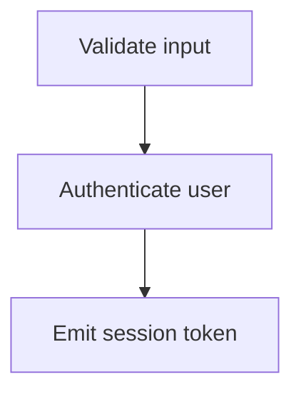

# Interactive Selection

Every page generated by `visual-explainer` is interactive: the user clicks an element (or fills a form built from a table), the selection is sent back to the agent, and the browser window closes automatically. The agent then prompts the user about what to do with the selection.

This document is the canonical reference for **how to author selectable elements**. Read it every time you generate HTML.

---

## How it works (one paragraph)

The agent runs `scripts/ve-select.py <file.html>`. The script picks a free localhost port, serves the file (injecting a stub PWA manifest so Chrome's `--app=URL` mode works on Chrome ≥120), and launches Chromium in `--app=URL` mode — a clean, borderless app-mode window that allows `window.close()`. The page embeds `scripts/ve-runtime.js`, which wires up clicks on every `[data-ve-id]` element. **As of phase 1 of the multi-select overhaul, clicks toggle the element in/out of `window.veSelection` (an in-memory chronological list), and the runtime injects two mirrored Submit/Exit buttons (top-right + bottom-left).** Pressing **Enter** anywhere — or clicking either button — POSTs `{kind:"submit"|"exit", count, selections:[...]}` to `/__ve-select`, then closes the window. **ESC** clears multi-select but never touches form-mode checkboxes. The script captures the POST, prints the JSON to stdout, and exits. The agent reads stdout and continues.

If no Chromium-based browser is found, the script falls back to the user's default browser; the runtime detects this and shows a "copy this JSON, paste to the agent" overlay so the flow still terminates cleanly.

### Page CSS contract (multi-select)

Hover and selected use the **same accent colour**; only a runtime-injected `drop-shadow` glow tells the user "this is hover, not selected". Two CSS contracts must be honoured:

**1. Set `--ve-accent` on `:root` (one line per palette)**

The runtime's hover glow is `drop-shadow(0 0 4px var(--ve-accent, currentColor))`. Without `--ve-accent` it falls back to `currentColor` — which is the page's text colour, almost always dark, producing an ugly grey halo on hover. Set the variable to whatever colour your hover/selected highlight uses:

```css
:root {
  --gold: #b8861f;
  --ve-accent: var(--gold);    /* tells the runtime: paint the hover glow gold */
}
@media (prefers-color-scheme: dark) {
  :root {
    --gold: #e0bf5b;
    --ve-accent: var(--gold);
  }
}
```

**1b. Selection text colour (`--ve-sel-text`) — guaranteed contrast**

The runtime forces every multi-click selection (`.ve-text-sel`, `[data-ve-text-sel-block]`, `[data-ve-math-sel]`) to use `--ve-sel-text` (default `#14110b`, near-black). Without this override the selected text inherits the page text colour, and accent-colour palettes whose hue overlaps with the body text — e.g. **gold accent + warm-tone body text in dark mode** — produce highlights that are nearly the same hue as the surrounding text. The selection becomes visible only by the outline, not by colour, and reading the selected substring requires squinting.

The forced colour is near-black because the highlight tint (`color-mix(--ve-accent, transparent)`) is always the LIGHTER end of the accent's luminosity range — black contrasts against any light tint regardless of hue.

If your accent is a dark tone (e.g. deep navy on a dark background) and black-on-tinted-navy is itself low-contrast, override on `:root`:

```css
:root { --ve-sel-text: #ffffff; }   /* white text on a dark accent highlight */
@media (prefers-color-scheme: light) {
  :root { --ve-sel-text: #14110b; } /* and revert to near-black in light mode */
}
```

The runtime also forces descendants of `[data-ve-text-sel-block]` and `[data-ve-math-sel]` to `color: inherit` so KaTeX glyphs (which set their own `color`) and inline `<code>`/`<a>` children don't override the selection text colour.

**2. Mirror every `:hover` palette rule to `[data-ve-selected="1"]`**

For pages that override the runtime's default brightness-only highlight (e.g. graph palettes that set explicit hover colours), every `:hover` rule MUST be mirrored to `[data-ve-selected="1"]` via a comma-list selector:

```css
/* Hover and selected — same paint */
.ve-graph svg .node:hover circle,
.ve-graph svg .node[data-ve-selected="1"] circle {
  fill: var(--accent-dim);
  stroke: var(--gold);
  stroke-width: 3;
}
.ve-graph svg .edge:hover path,
.ve-graph svg .edge[data-ve-selected="1"] path {
  stroke: var(--gold);
  stroke-width: 2.2;
  opacity: 1;
}
```

Don't add a `filter: drop-shadow(...)` to the selected variant — the runtime adds the glow only on hover, and you want hover-on-selected to look different from selected-not-hovered. Page-CSS authors who do add a glow themselves should scope it to `:hover` only, never to `[data-ve-selected]`.

---

## Mandatory boilerplate

Every generated page must include:

```html
<!-- in <head>, after styles -->
<script src="VE_RUNTIME_URL"></script>
```

`VE_RUNTIME_URL` resolves to `ve-runtime.js` in the same directory. When the agent generates a page, it copies `scripts/ve-runtime.js` into the same directory as the HTML file (or beside it under `~/.agent/diagrams/`) and references it relatively, e.g. `<script src="ve-runtime.js"></script>`.

For maximum portability you can inline the runtime instead — see "Inlining the runtime" below.

---

## The selection payload

As of phase 1 of TRDD-7a98 (multi-select overhaul), every page submission has the shape:

```json
{
  "kind": "submit",        // "submit" if the user picked anything; "exit" if they closed empty
  "count": 2,
  "selections": [
    {"kind": "element", "id": "ve-node-H",      "type": "graph-node", "label": "HUMAN", "data": {"graphId": "ve-graph-1", "kind": "node", "dotSource": "..."}},
    {"kind": "element", "id": "ve-edge-H-to-M", "type": "graph-edge", "label": "H->M",  "data": null}
  ]
}
```

Each entry inside `selections[]` has these fields:

| Field   | Required | Purpose                                                                 |
|---------|----------|-------------------------------------------------------------------------|
| `kind`  | yes      | Selection-entry kind. Phase 1 = always `"element"`. Future phases add `"text"`, `"row"`, `"column"`, `"codeline"`, `"codelines"`. |
| `id`    | yes      | Stable identifier the agent uses to disambiguate                        |
| `type`  | yes      | Category hint (`mermaid-node`, `card`, `table-cell`, `chart-point`, `slide`, `kpi`, `timeline`, `file`, `section`, `graph-node`, `graph-edge`, `element`, …) |
| `label` | yes      | What the user perceives they clicked — used in the agent's reply        |
| `data`  | no       | Anything the agent needs to act: row/col indices, file paths, values, dataset metadata, full DOT source for graph entries |

**Legacy single-shot path (table-form Mode B/C, text-snippet popup)**: still produces the older flat `{id, type, label, data}` shape — those flows haven't been ported to the multi-select set yet (they're slated for phases 4 and 5). Branch on whether the top-level payload has `selections` (new multi-select) or `id` (legacy single-shot).

### Phase 2 — multi-click text selection inside `[data-ve-prose]`

Clicks on text content inside any `[data-ve-prose]` container trigger graduated selection. **Depths 1-3** paint a sub-paragraph fragment via inline `<span class="ve-text-sel">` (Phase 2). **Depths 4-7** climb the paragraph-numbering hierarchy and paint whole elements via `[data-ve-text-sel-block]` (Phase 3 — see next sub-section).

Each click within 500ms and 8px of the previous one bumps the depth, replacing the previous selection; a new chain after the grace period starts at depth=1 again. Per the user spec, **multi-click NEVER deselects** — only ESC or a drag-deselect (Phase 4) removes a `text` entry.

| Depth | Scope | Boundary detector |
|------:|-------|-------------------|
| 1     | grapheme | Intl.Segmenter `granularity:'grapheme'` — handles emoji + surrogate pairs at the cursor character |
| 2     | word     | Intl.Segmenter `granularity:'word'` — locale-aware |
| 3     | block    | non-whitespace run that stops at brackets / quote marks, but keeps comma and period when both neighbours are digits (so `10,000,000.00`, `10.000.000,00`, `3.14`, `1/2`, `9:30`, `name@host`, `12:34:56-05:00` all stay whole) |
| 4     | paragraph | the single `[data-ve-pnum]` element under the click |
| 5     | section  | chop one segment from the paragraph number (`1.2.1` → `1.2`); paint every `[data-ve-pnum]` whose number equals `1.2` or starts with `1.2.` |
| 6     | chapter  | keep only the first segment (`1.2.1` → `1`); paint every `[data-ve-pnum]` under chapter `1` |
| 7     | all prose | every `[data-ve-pnum]` inside the `[data-ve-prose]` container |

Each `kind:"text"` payload entry carries:

```json
{
  "kind": "text",
  "text": "10,000,000.00",
  "depth": 3,
  "paragraphId": "1.1",                   // numbered hierarchy from data-ve-pnum
  "paragraphText": "1.1 This is a simple paragraph for testing the …"
}
```

`paragraphId` is the hierarchical paragraph number from the existing `numberProse()` system (also used by Phase 1 element paragraph clicks). `paragraphText` is the full paragraph context, ≤240 chars, so the agent can reason about the snippet's surroundings without re-fetching the page.

The runtime injects a default `.ve-text-sel` style (`background: color-mix(in srgb, var(--ve-accent, #b8861f) 32%, transparent)`) — pages can override colour, padding, border-radius via their own rule. Selection spans are unwrapped on ESC (`clearAllTextSelections()`) and individually on chain-bump (`removeTextSelection(entryId)`).

Locale comes from `<html lang>` only (per user feedback `navigator.language` is unreliable on Safari mobile). Default = US format. European locales (it, de, nl, da, nb, pt, pl, tr, vi, id, is, el, ru, uk, bg, hr, cs, hu, lv, mk, ro, sk, sl, bs, mt, sr) get period-thousand-comma-decimal; French-family (fr, fi, et, lt, sv) gets space-thousand-comma-decimal.

Clicks land on text nodes via `caretPositionFromPoint` / `caretRangeFromPoint`. The chain is keyed by **screen coordinates**, not text-node identity — surroundContents splits text nodes, so the textNode reference is invalidated after the first paint and the chain would otherwise reset to depth=1 on every subsequent click.

#### Phase 3 — block-level depths 4-7 (paragraph / section / chapter / all)

At depth 4+, the selection no longer fits inside a single text node — it spans across paragraphs, sections, or even the whole article. The Phase 2 inline-span path can't represent this (Range.surroundContents throws on cross-element ranges), so depths 4-7 take a **block-attribute path** instead:

1. The dispatcher in `handleProseClick` reads `lastClickChain.depth` and routes:
   ```js
   if (lastClickChain.depth <= 3) { /* inline path: surroundContents */ }
   else                            { /* block path:  data-ve-text-sel-block */ }
   ```
2. The block path resolves the click to its containing `[data-ve-pnum]` element, reads its hierarchical number (`pnum`), then computes the **scope** — the prefix that every paragraph in the new selection must match:
   ```js
   function pnumScope(currentPnum, depth) {
     if (depth === 4) return currentPnum;        // single paragraph
     var parts = currentPnum.split('.');
     if (depth === 5) parts.pop();                // chop one segment
     else if (depth === 6) parts = [parts[0]];    // keep first segment
     return parts.join('.');
   }
   ```
3. `elementsInPnumScope(scope)` returns every `[data-ve-pnum]` whose number equals the scope or starts with `scope + "."` (for depth 7 it returns *every* numbered element in the prose container).
4. `paintBlockSelection(elements, depth)` mints a single `entryId` and stamps `data-ve-text-sel-block="<entryId>"` on every element. The runtime auto-injects this CSS rule:
   ```css
   [data-ve-text-sel-block] {
     background: color-mix(in srgb, var(--ve-accent, #b8861f) 16%, transparent);
     border-radius: 4px;
     outline: 1px solid color-mix(in srgb, var(--ve-accent, #b8861f) 50%, transparent);
     outline-offset: 2px;
   }
   ```
   The 16% tint is deliberately lighter than `.ve-text-sel`'s 32% — block selections cover a much larger area and a darker tone overpowers the page.
5. `removeTextSelection(entryId)` walks **both** paths — it unwraps any inline span AND clears the `data-ve-text-sel-block` attribute on every matching element. Same for `clearAllTextSelections()` (ESC). This means `removeTextSelection` is safe to call regardless of which depth produced the entry.

**Wire-format note for depths 4-7**: `text` is the concatenation of every painted element's `textContent`, joined with single spaces and capped at 5000 chars. `paragraphId` is the **first** painted paragraph's number (so the agent can derive the full scope from `paragraphId + depth + the depth-to-scope rules above`). `paragraphText` is the same buffer truncated to 240 chars.

**Degradation rule**: if the click lands inside `[data-ve-prose]` but on text outside any `[data-ve-pnum]` (e.g. a non-numbered intro paragraph), the runtime falls back to depth-3 block selection — chain depth is also reset to 3 so the next click still bumps to 4. This avoids the "click did nothing" UX failure when the page author forgot to wrap a paragraph.

**Verification baseline** (from `tests_dev/prose-depths-1-7.html`, 2026-05-05): clicking the second word of paragraph "1.1.1" with 700ms gaps produced strictly increasing scopes — d1=" " (single grapheme), d2=" " (word), d3="Third" (block), d4=full paragraph 1.1.1, d5=section 1.1 (3 paragraphs), d6=chapter 1 (5 paragraphs), d7=all 7 paragraphs across both chapters. The 700ms gap is required because shorter gaps stay within the 500ms grace window and accumulate the wrong chain.

#### Phase 3 — math grammar (sub-formula depths 1-3 inside `.ve-math`)

Multi-click on a `.ve-math` (or `[data-ve-math]`) element **inside `[data-ve-prose]`** activates a parallel sub-formula depth grammar. KaTeX renders LaTeX into nested `<span>` trees with predictable class names (`mord`, `mbin`, `mrel`, `mop`, `mopen`, `mclose`, `mpunct`, `minner`, `mfrac`, `msupsub`); the runtime walks that tree to find the smallest atom under the click and bubbles outward on each chain bump:

| Depth | Math scope | What gets painted |
|------:|-----------|-------------------|
| 1 | atom | the smallest KaTeX span under the cursor (a single variable, digit, operator, or delimiter) |
| 2 | group | the enclosing group container (parent `.mord` / `.mfrac` / `.msupsub` / `.minner`) |
| 3 | formula | the whole `.ve-math` element |
| 4 | paragraph | the `[data-ve-pnum]` element wrapping the formula (text + math + everything else) |
| 5 | section | chop one segment from the paragraph number (same rule as prose depth 5) |
| 6 | chapter | keep first segment (same rule as prose depth 6) |
| 7 | all prose | every `[data-ve-pnum]` in the prose container |

Depths 1-3 emit a `kind:"math"` entry; depths 4-7 emit a `kind:"text"` block-selection entry (identical to the prose Phase 3 path) since at that point the user's intent is "the surrounding paragraph", not "more math".

```json
{
  "kind": "math",
  "depth": 2,
  "text": "c^2",
  "formulaLatex": "E = mc^2",
  "paragraphId": "1.2.1",
  "paragraphText": "Einstein's mass-energy equivalence E = mc^2 holds in any inertial frame."
}
```

`text` is what the user visually selected (the rendered glyph(s) of the painted span), capped at 240 chars. `formulaLatex` is the **full** LaTeX source of the parent `.ve-math` (read from its `data-ve-math-source` attribute, set during render) — the agent has both the local fragment and the surrounding formula and can decide how to act. `paragraphId` and `paragraphText` carry the prose context exactly like prose Phase 2 entries.

**Highlight CSS** (auto-injected, not page-overrideable today):
```css
[data-ve-math-sel] {
  background: color-mix(in srgb, var(--ve-accent, #b8861f) 24%, transparent);
  border-radius: 3px;
  outline: 1px solid color-mix(in srgb, var(--ve-accent, #b8861f) 60%, transparent);
  outline-offset: 1px;
}
```
The 24% tint sits between `.ve-text-sel`'s 32% and the block 16% — math atoms are tiny (often a single character), so they need a sharper contrast than block selections, but a heavier fill obscures the rendered glyph.

**Backwards-compat for non-prose math.** `.ve-math` outside `[data-ve-prose]` (slide decks, dashboards, isolated diagrams) still uses the Phase 1 single-click `math-formula` element-toggle. The multi-click math grammar fires **only** when the formula is inside a `[data-ve-prose]` container — the same gate that scopes prose multi-click. This means slide decks and reports keep their existing single-click-to-toggle UX, while documents/articles get the depth grammar.

**Painted attribute is `[data-ve-math-sel="<entryId>"]`** — placed on the atom span at depth 1, the group span at depth 2, or the `.ve-math` itself at depth 3. `removeChainSelection` dispatches by `entryId` prefix (`"math:"` → `removeMathSelection`, `"code:"` → `removeCodeSelection`, anything else → `removeTextSelection`) so the chain-bump unwrap is uniform across grammars.

#### Phase 3 — code grammar (token / line / block depths 1-3 inside `<pre>`)

Multi-click on any `<pre>` (or any descendant — typically a `<code>`) **inside `[data-ve-prose]`** activates the code depth grammar:

| Depth | Code scope | What gets painted |
|------:|-----------|-------------------|
| 1 | token | the smallest token under the cursor — Prism's `.token` ancestor or a highlight.js `.hljs-*` span if present, otherwise a word-range from the caret position |
| 2 | line  | the line containing the click, bounded by `\n` (single-character empty lines wrap a 1-char range so `surroundContents` succeeds) |
| 3 | block | the whole `<pre>` element |
| 4 | paragraph | the nearest `[data-ve-pnum]` (climbing the prose hierarchy from the `<pre>`'s containing element, **or** the closest preceding `[data-ve-pnum]` in document order if `<pre>` has no numbered ancestor — the runtime's `PARA_TAGS` defaults to `PRE: 0` so `<pre>` isn't auto-numbered) |
| 5 | section | chop one segment from that paragraph number |
| 6 | chapter | keep first segment |
| 7 | all prose | every `[data-ve-pnum]` in the prose container |

Depths 1-3 emit `kind:"code"` entries; depths 4-7 emit `kind:"text"` block-selection entries (same as the prose / math fallthrough).

```json
{
  "kind": "code",
  "depth": 2,
  "text": "function fib(n) {",
  "language": "javascript",
  "codeId": null,
  "paragraphId": "1.1.1",
  "paragraphText": "1.1.1 The classic Fibonacci function:"
}
```

`language` is read from `<pre data-language="…">` first, then from a `<code class="language-…">` inside the `<pre>` (Prism's convention). `codeId` is the `<pre>`'s `data-ve-id` if present, else `null`. `paragraphId` is the **closest containing or preceding** numbered element so the agent can name the section even when the `<pre>` itself isn't numbered.

**Highlight CSS** (auto-injected):
```css
[data-ve-code-sel] {       /* depths 1-2 — inline span over a token or a line */
  background: color-mix(in srgb, var(--ve-accent, #b8861f) 22%, transparent);
  color: var(--ve-sel-text);
  border-radius: 3px;
  outline: 1px solid color-mix(in srgb, var(--ve-accent, #b8861f) 65%, transparent);
  outline-offset: 1px;
}
[data-ve-code-sel-block] { /* depth 3 — whole <pre> */
  background: color-mix(in srgb, var(--ve-accent, #b8861f) 14%, transparent);
  color: var(--ve-sel-text);
  border-radius: 6px;
  outline: 1.5px solid color-mix(in srgb, var(--ve-accent, #b8861f) 55%, transparent);
  outline-offset: 3px;
}
[data-ve-code-sel] *, [data-ve-code-sel-block] * { color: inherit; }
```
The descendant `color: inherit` is critical when Prism / highlight.js are loaded — both syntax highlighters set explicit `color` on per-token spans, and without `inherit` the selection's `--ve-sel-text` would lose to the per-span colour.

**Backwards-compat for non-prose `<pre>`.** A `<pre>` outside `[data-ve-prose]` (a slide-deck code card, a dashboard widget) keeps the Phase 1 element-click toggle (when stamped with `data-ve-id`). The depth grammar fires **only** inside `[data-ve-prose]`.

**Verified empirically** (2026-05-05) against `tests_dev/prose-code-depths-1-7.html`: clicking the `i` of `fib` in `function fib(n) { … }` 7 times at 200 ms intervals produced d1=`fib`, d2=`function fib(n) {`, d3=full Fibonacci block, d4=section 1.1.1 (3 paragraphs around the `<pre>`), d5=section 1.1, d6=chapter 1, d7=all 7 numbered elements.

#### Phase 4 — drag text selection toggles entries (the only deselect path)

Standard browser text drag (mouse-down, drag, mouse-up) works alongside the multi-click depths. Per TRDD §3.5:

- **Drag inside `[data-ve-prose]` (and not inside `.ve-math` / `.ve-tikz`)** captures the highlighted Range on `mouseup`. The popup is bypassed.
- **Match key**: trimmed-and-collapsed text content + `paragraphId`. If both candidate and existing entry have a `paragraphId` they must match; if either is `null` (e.g. a paragraph the prose numberer skipped), match by text alone.
- **If a match exists** → REMOVE the existing entry (and unwrap its DOM marker). This is the **only** path that deselects a text entry.
- **If no match** → ADD a new `kind:"text"` entry with `depth:"drag"` and paint a `<span class="ve-text-sel ve-text-sel--drag">` around the range.

Multi-click depths 1-7 are still **add-only** — re-clicking the same word never deselects. Only drag deselects.

```json
{
  "kind": "text",
  "depth": "drag",
  "text": "quick brown fox",
  "paragraphId": "1.1",
  "paragraphText": "1.1 The quick brown fox jumps over the lazy dog. …"
}
```

A drag that crosses element boundaries (e.g. spans two paragraphs, or includes inline children) falls back to `Range.extractContents()` + `Range.insertNode()` so the wrapping span always succeeds — `surroundContents` would otherwise throw.

`.ve-math` / `.ve-tikz` drags still go through the snippet popup → `postSelection()` single-shot path, because their domain-specific payloads (`fullFormulaLatex`, `fullDiagramLatex`, `chem` flag) haven't been multi-select-converted yet.

**Verified empirically** (2026-05-06) against `tests_dev/prose-drag-toggle.html`:
1. Drag-select "quick brown" in p1 → 1 entry, `depth:"drag"`, `paragraphId:"1.1"`.
2. Drag-select the same painted span → entry count returns to 0, span removed from DOM.
3. Single click in p1 (multi-click depth 1) after a drag does NOT toggle the drag entry — it adds its own depth-1 entry next to it.
4. ESC clears all drag and multi-click entries (`clearAllTextSelections` walks every `[data-ve-text-sel]`).

#### Phase 5 — table row/column handles

Every `<table>` that is **not** a table-form (`data-ve-type="table-form"`) is wrapped on init in a `.ve-table-wrapper` with an absolutely-positioned `.ve-table-handles-overlay`. Inside the overlay, four small handle buttons are rendered per body row + per column:

| Handle | Position | Toggles |
|--------|----------|---------|
| `◀` | 6 px left of each `<tr>` | `kind:"row"` (1-based body-row index) |
| `▶` | 6 px right of each `<tr>` | `kind:"row"` (same row) |
| `▼` | 6 px above the column's first body cell | `kind:"column"` (1-based) |
| `▲` | 6 px below the column's last body cell | `kind:"column"` (same column) |

The wrapper carries an extra 24 px outer padding (with a -12 px margin to keep document flow) so the cursor reaches the handles before drifting fully out of the table's hit-zone.

```json
{ "kind": "row",    "table": "perm-matrix", "row": 3, "header": "MAINTAINER" }
{ "kind": "column", "table": "perm-matrix", "col": 4, "header": "ADMIN" }
```

- `table` is the table's `data-ve-id` (auto-stamped if absent).
- `row` / `col` are 1-based.
- `header` is the first-cell text (rows) or the `<thead>` cell text (columns), trimmed and clamped to 80 chars.

**Visual marking**: selected rows get `data-ve-row-selected="1"` on the `<tr>`, painted via the standard injected CSS rule. Selected columns drive a dynamic per-table `<style id="__ve-table-col-styles">` sheet that emits `tr > td:nth-child(N)` rules — one per selected column. Intersection cells appear with both tints overlaid; **they are not separate entries** (the agent reads "rows X + columns Y" and reasons about the intersection itself).

**Toggle / persistence**: re-clicking the same handle removes the entry. ESC also clears every `kind:"row"` / `kind:"column"` entry (the global ESC handler calls `repaintTableHandles()` which iterates the now-empty `veSelection` and resets every handle's `[data-ve-pressed]`). Clicking inside individual cells does NOT deselect a row or column — that requires re-clicking the handle.

**Layout**: the overlay uses `pointer-events: none` and the handles re-enable `pointer-events: auto`, so clicks on cells pass through the overlay normally. Handle positions are recomputed on `ResizeObserver` ticks and on `window.resize`.

**Verified empirically** (2026-05-06) against `tests_dev/table-handles.html` (a 5×5 permission matrix):
1. Click ◀ next to MAINTAINER → 1 entry, `row:3`, `header:"MAINTAINER"`.
2. Click ▼ above ADMIN → second entry, `col:4`, `header:"ADMIN"`.
3. Click ◀ next to VIEWER → third entry, `row:1`, `header:"VIEWER"`. Both VIEWER and MAINTAINER rows highlighted; ADMIN column highlighted; intersection cells doubly-tinted.
4. Click ◀ next to MAINTAINER again → entry removed, row de-highlighted; VIEWER + ADMIN remain.
5. ESC → all entries cleared, every `[data-ve-pressed]` reset, dynamic column CSS sheet emptied.

#### Phase 6 — code line-number gutter

Every `<pre>` (anywhere in the page, not just inside `[data-ve-prose]`) is wrapped on init in a `.ve-code-block` flex container with a `.ve-code-gutter` to its left. The gutter contains one `<button class="ve-code-linenum" data-line="N">` per line. Pages opt out by stamping `[data-ve-no-gutter]` on the `<pre>`.

| Action on a line number | Wire entry pushed |
|-------------------------|---|
| Single click on line N | `{kind:"codeline", block, line:N}` (toggle: re-clicking removes) |
| Drag from line N to line M | `{kind:"codelines", block, fromLine:min, toLine:max}` (additive — re-dragging never deselects) |
| Double-click on any line | `{kind:"codelines", block, fromLine:1, toLine:lineCount}` (whole block) |
| Triple-click on any line | clears every `codeline` / `codelines` entry for this block |

Click count detection uses a 350 ms idle window — same pattern as the prose multi-click chain. During a drag, the gutter line numbers under the cursor get `[data-ve-preview="1"]` so the in-progress range is visible before the user releases the mouse. Selected lines (after release or click) get `[data-ve-pressed="1"]`.

`block` is the `<pre>`'s `data-ve-id` (auto-stamped if absent). Line numbers are 1-based and counted by splitting `pre.textContent` on `\n` (with a single trailing newline trimmed so the count matches what the user sees).

```json
{ "kind": "codeline",  "block": "ve-code-fib", "line": 4 }
{ "kind": "codelines", "block": "ve-code-fib", "fromLine": 6, "toLine": 8 }
```

The Phase 3 in-text code grammar (token / line / block depths 1-3 inside `<pre>` inside `[data-ve-prose]`) still works — clicks on the code TEXT go to that handler; clicks on the gutter line numbers go here. The runtime element-toggle handler bails inside `[data-ve-prose]` and inside `.ve-regex` already, so the gutter doesn't need its own exclusion guard.

**Out of scope** (deferred to a future tweak): the TRDD's "drag back over already-selected lines DESELECTS them" — within a single drag, reverse-motion currently keeps the line selected. The post-drag entry is always additive.

ESC clears `kind:"codeline"` / `kind:"codelines"` along with every other entry — the global ESC handler calls `repaintCodeGutters()` after clearing `veSelection`, which iterates the now-empty array and removes every `[data-ve-pressed]`.

**Verified empirically** (2026-05-06) against `tests_dev/code-gutter.html` (Fibonacci 10 lines + Quicksort 7 lines):
1. Single click line 4 of fib → `codeline:4`. Pressed `[4]`.
2. Drag line 6 → 8 of fib → `codelines:6-8`. Pressed `[4, 6, 7, 8]`.
3. Double-click qs line 1 → `codelines:1-7` for qs. Pressed `[1..7]` in qs.
4. Triple-click qs line 1 → all qs entries cleared. Fib entries untouched.

#### Phase 7 — touch / mobile compatibility

Detection runs on first call to `isTouchDevice()`:

```js
'ontouchstart' in window
  || navigator.maxTouchPoints > 0
  || navigator.msMaxTouchPoints > 0
```

When touch is detected, `<body data-ve-touch="1">` is set. CSS scoped to that attribute upgrades the runtime's interactive surfaces:

| Surface | Desktop | Touch |
|---------|---------|-------|
| Table row/column handles | 22 × 22 px, 11 px font, 0.55 hover opacity | 32 × 32 px, 14 px font, 0.85 hover opacity |
| Code-gutter line numbers | `padding: 0 10px 0 8px` | `padding: 6px 12px 6px 10px` (taller hit-strip) |

Drag-text-select on prose works via the existing browser long-press → text-selection → `selectionchange`. A `touchend` listener mirrors the desktop `mouseup` listener and runs `handleProseDragSelection()` first; if it bails (selection is in math/tikz, or is empty), the snippet popup runs as fallback.

Code-gutter drag uses dedicated `touchstart` / `touchmove` / `touchend` handlers (capture-phase). `touchstart` on a line number begins the drag, `touchmove` resolves the line under the finger via `document.elementFromPoint(touch.clientX, touch.clientY)` (touches don't bubble through `mouseover`), and `touchend` finalises the range.

Touch tap fires the standard `click` event, so the multi-click chain (1× toggle / 2× select-all / 3× clear-block) works unchanged on touch.

A floating **Clear all** button appears at `bottom: 14px; left: 120px` (next to the bottom-left Submit/Exit) **only on touch devices** and **only when `veSelection.length > 0`**. It mirrors what ESC does — wipes every entry, repaints every surface, then hides itself.

```js
window.addEventListener('keydown', e => { /* ESC → clear */ });
clearAllBtn.click();           // touch equivalent
```

**Verified empirically** (2026-05-06) against `tests_dev/table-handles.html` in Chrome DevTools touch-emulated viewport (414 × 896, devicePixelRatio 2, mobile, touch):
1. `body[data-ve-touch="1"]` set on init.
2. `.ve-table-handle` computed size = 32 × 32 px, font 14 px (was 22 × 22 / 11 px on desktop).
3. With nothing selected, Clear-all `display:none`. After clicking ◀ (MAINTAINER) and ▼ (ADMIN), Clear-all flips to `display:block`. Click → entries cleared, button hidden again.

#### Interactive agent reports — `kind:"finding-reply"` (TRDD-eff1aa87)

Pages rendered by `scripts/render-interactive-report.py` carry one or more

```html
<textarea class="ve-finding-reply" data-ve-finding-reply
          data-ve-finding-id="finding-N" rows="3"
          placeholder="Reply to this finding…"></textarea>
```

inside each `<section data-ve-finding-id="finding-N">`. The runtime listens for `input` events on those textareas (debounced 350 ms). On each keystroke, it pushes / replaces a single `kind:"finding-reply"` entry per `findingId` (the entry's `entryId` is `finding-reply:<findingId>` so the same finding can never appear twice).

```json
{ "kind": "finding-reply",
  "entryId": "finding-reply:finding-1",
  "findingId": "finding-1",
  "text": "I prefer to default to '' instead." }
```

Empty (after trim) → entry removed. ESC clears every `finding-reply` entry AND empties the visible textarea contents (`clearAllFindingReplyTextareas()`).

The orchestrator (the slash command `/visual-explainer:interactive-report`) reads the submit POST, generates a per-finding `claude` response per entry, appends `{round, user, claude}` to `<report>.replies.json`, then re-runs the renderer. The next iteration of the page shows the new round of replies as a `<div class="ve-finding-round">` block above the always-present new-reply textarea — Claude's response sits inline next to the user's comment, exactly as requested.

**Verified empirically** (2026-05-06) against `tests_dev/sample-report.html` (4 findings, with `replies.json` carrying 1 prior round on finding-2):
1. Renderer emitted 4 `<section data-ve-finding-id="finding-N">` wrappers.
2. Severity chips rendered (minor / major / info / info).
3. Finding-2 showed 1 prior round (User · round 1 quote + Claude · round 1 reply) above its empty textarea.
4. Typing into finding-1's textarea pushed `kind:"finding-reply" findingId:"finding-1"` entry; submit count showed `(1)`.
5. Updating the same textarea text replaced the entry (no duplicate).
6. Clearing the textarea (whitespace-only) removed the entry (count returned to 0).
7. Adding a finding-3 reply alongside finding-1 → 2 entries, submit count `(2)`.

#### Interactive agent reports v2 — modal comment threads (TRDD-eff1aa87 §6)

The renderer (`render-interactive-report.py`) now stamps every `<p>`, `<li>`, `<tr>`, `<pre>`, section heading, and finding-meta with a stable `data-ve-comment-id="<8-char-hex>"`. The id is a sha-1 of the element's normalised text (whitespace-collapsed, first 200 chars), so the same paragraph in the same report always gets the same id across re-renders. The renderer also writes a sidecar **`<report>.idmap.json`** mapping every id → `{kind, sectionId, text}` — Claude's `/visual-explainer:respond-to-comment` slash command consults this when an unknown id arrives, so the doc only needs to be re-read once per session.

On hover of any commentable element, the runtime injects a "💬 Comment this" pill in the top-right corner. Click → modal opens on the right of the viewport (460 px wide), the page reflows so the modal never overlaps text (`body[data-ve-comment-modal-open="1"] main { margin-right: 480px; pointer-events: none }`), and the active anchor gets a gold outline ring.

Modal layout matches the user's sketch:

```
----------------------------------------
|  thread  |                           |
|----------|                           |
| 1:  user |                           |
| 2: agent |  (text of the active      |
|>3:  user<|   turn; becomes an input  |
|          |   box when active is the  |
|          |   next-to-compose user    |
|          |   draft)                  |
|--------------------------------------|
|    [ANSWER]           [DONE]         |
----------------------------------------
```

- Left column: clickable thread index, one row per turn, `> N: role <` markers on the active turn.
- Right column: the active turn's text or, if it's a draft user turn, an editable textarea.
- ANSWER: when active is a draft user turn → submit it (POST `/__ve-comment`, page polls `/__ve-reply/<threadId>` every 1.5 s, the agent's reply lands in the SAME box without page reload). When active is any past turn → append a new user-draft at the bottom of the thread, focus its textarea.
- DONE: save thread to localStorage and close the modal. ESC also closes.

Wire format — POST body to `/__ve-comment`:
```json
{ "commentId": "7e82b077",
  "threadId":  "thread-7e82b077-mou200pw",
  "sourcePath":"/path/to/report.md",
  "turn": 1,
  "text": "Why polling instead of SSE?" }
```

Reply file the orchestrator writes (`<queue-dir>/<threadId>.reply.<turn>.json`):
```json
{ "turn": 2, "role": "agent", "text": "Polling fits the runner architecture: …" }
```

Thread state is persisted to `localStorage[ 've-comment-thread:'+commentId ]` so a page reload preserves the full history.

**Verified empirically** (2026-05-06) against the symphony-vs-amoa comparison report (570 lines, 11 H2 sections, 139 commentable elements) served by a v2-aware Python http server:
1. Hover on a `<p data-ve-comment-id="7e82b077">` → pill rendered, opacity 0.7+.
2. Click pill → modal opens with title `Comment · #7e82b077`, page reflows, anchor gets gold ring, draft turn 1 visible with focused textarea.
3. Type reply, click ANSWER → POST landed in queue; thread now `[1: user, > 2: agent <]` with "Waiting for Claude to reply…" placeholder.
4. Wrote a fake reply file → page polled, picked it up within 2 s, replaced the pending turn with Claude's text inline. Active turn = 2 (agent).
5. Click ANSWER → new draft turn 3 appended, textarea focused. Thread index shows `[1: user, 2: agent, > 3: user <]`.
6. Click row 1 in the index → right pane switches to original user comment text. Click row 2 → switches to Claude reply. Click row 3 → back to draft textarea.
7. ESC → modal closes, page restored, anchor un-ringed.
8. Re-hover same paragraph + click pill → modal reopens with full thread history (3 turns) restored from localStorage.

**Timeout/error sentinels** (the runner emits these when no submission arrives or when something is structurally wrong) keep their old shape too: `{"id": null, "reason": "timeout|no-file|missing-file|no-browser|...", ...}`.

### Required follow-up

Branch on `kind` first, then `count`:

| Case                                | Open with                                                                                                |
|-------------------------------------|----------------------------------------------------------------------------------------------------------|
| `kind: "exit"` (count = 0)          | "You closed without selecting anything. Want me to regenerate / change the layout / something else?"     |
| `kind: "submit"` and count = 1      | "You selected the element **«label»** (`«type»: «id»`). What do you want me to do about it?"             |
| `kind: "submit"` and count ≥ 2      | "You selected **N items**: «label1» (`«type1»`), «label2» (`«type2»`), … . What should I do with them?"  |
| Legacy flat payload (with top-level `id`) | "You selected the element **«label»** (`«type»: «id»`). What do you want me to do about it?"        |

…then wait for the user's instruction.

For per-entry kinds beyond `element`, branch a second time on the entry's own `kind` field:

| Entry kind        | Open with                                                                                                |
|-------------------|----------------------------------------------------------------------------------------------------------|
| `text`            | "You picked the snippet **«text»** (paragraph «paragraphId» at depth «depth»). What should I do with it?" |
| `math` (depth 1-3)| "You picked the math fragment **«text»** inside the formula `«formulaLatex»`. What should I do with it?" |
| `code` (depth 1-3)| "You picked **«text»** in the code block (`«language»`). What should I do with it?"                       |
| `row`             | "You picked **row «row»** of table `«table»` (header «header»). What should I do with it?"                |
| `column`          | "You picked **column «col»** of table `«table»` (header «header»). What should I do with it?"             |
| `codeline`        | "You picked **line «line»** of code block `«block»`. What should I do with it?"                           |
| `codelines`       | "You picked **lines «fromLine»–«toLine»** of code block `«block»`. What should I do with them?"           |
| `regex-edit`      | "You changed the regex from `«original»` to `«edited»`. Want me to update the test cases / explanation / surrounding code?" |
| `finding-reply`   | (no prompt — read the user's per-finding text and append a per-finding `claude` response to the sidecar replies.json, then re-render via `/visual-explainer:interactive-report`) |

`regex-edit` is special — it represents a USER-AUTHORED MUTATION rather than a click on an existing element. The `original` and `edited` strings + the `ast` give the agent everything needed to act on the change without re-prompting.

---

## What to make selectable

Make selectable: anything the user might reasonably want to act on.

Do **not** make selectable: decorative prose, headings inside cards (the parent card is selectable instead), icons, page chrome.

| Content                          | Selectable? | Type hint        |
|----------------------------------|-------------|------------------|
| Mermaid node                     | always      | `mermaid-node`   |
| Mermaid edge / arrow             | optional    | `mermaid-edge`   |
| Section / hero card              | always      | `section` / `card`|
| KPI / metric card                | always      | `kpi`            |
| File entry in a file list        | always      | `file`           |
| Code block / snippet card        | yes (whole block) | `code`     |
| Timeline / roadmap entry         | always      | `timeline`       |
| Chart datapoint                  | always      | `chart-point`    |
| Slide container (slide deck)     | always      | `slide`          |
| Table row (data table)           | yes         | `table-row`      |
| Table cell (data table)          | yes         | `table-cell`     |
| Table-as-question (form mode)    | always      | `table-form`     |
| Architecture sub-component       | yes         | `card`           |
| Pull quote / callout box         | optional    | `callout`        |
| Plain prose paragraph            | **no**      | —                |
| Decorative SVG / icon            | **no**      | —                |

---

## Marking elements

The minimum: add `data-ve-id`. Add `data-ve-type` and `data-ve-label` for clarity. Add `data-ve-data` (JSON string) for extra context.

```html
<div class="ve-card"
     data-ve-id="auth-service"
     data-ve-type="card"
     data-ve-label="Auth service">
  <h3>Auth service</h3>
  <p>JWT-based session management.</p>
</div>
```

Rich payload via `data-ve-data` (a JSON string):

```html
<tr data-ve-id="row-2025-q1"
    data-ve-type="table-row"
    data-ve-label="2025 Q1 — $45,200"
    data-ve-data='{"period":"2025-Q1","revenue":45200,"sourceFile":"reports/q1.csv"}'>
  <td>2025-Q1</td><td>$45,200</td>
</tr>
```

The agent receives the parsed `data` object back and can use it directly in its next action.

---

## Mermaid integration

Mermaid renders SVG nodes that are not direct children of your HTML, so `data-ve-id` on the source node ID does not work. Use Mermaid's `click` directive to call into the runtime:



Add a `click` line for **every node the user might want to act on**. The first argument becomes the `id` (prefixed `ve-mermaid-`), the second becomes the `label`. Optional third argument is an extra-data object encoded as a JSON string.

For edges/arrows, the easiest pattern is to add an invisible label and `click` it the same way, or wrap the relevant node and call out the edge in `data` instead.

---

## Chart.js integration

After constructing a `Chart`, hand it to `veWireChart`:

```html
<canvas id="revenue-chart" width="800" height="320"></canvas>
<script>
  var chart = new Chart(document.getElementById('revenue-chart'), {
    type: 'line',
    data: { labels: ['Jan','Feb','Mar',…], datasets: [{ label:'Revenue', data:[…] }] },
    options: { responsive: true }
  });
  veWireChart(chart, { id: 'revenue' });
</script>
```

Clicking a datapoint sends:

```json
{
  "id": "ve-chart-revenue-d0-i2",
  "type": "chart-point",
  "label": "Revenue · Mar",
  "data": {
    "chartId": "revenue",
    "datasetIndex": 0,
    "datasetLabel": "Revenue",
    "index": 2,
    "xLabel": "Mar",
    "value": 45200
  }
}
```

> **Future:** range/interval selection (drag x1→x2) is on the roadmap. For now, single-point selection only; if the user wants an interval, they click one endpoint and tell the agent about the other in their reply.

---

## Regex visualizer + editor (`.ve-regex`)

For pages that explain or iterate on a regular-expression pattern, the runtime ships a vendored, re-skinned copy of [Bowen7/regex-vis](https://github.com/Bowen7/regex-vis) (MIT, see project-root `THIRD_PARTY_NOTICES.md`). One opt-in element renders both the SVG flow-graph AND the side panel where the user can mutate the regex visually:

```html
<div class="ve-regex" data-regex="^([a-z]+)@([a-z]+)\.com$"></div>
```

(The runtime also accepts `[data-ve-regex][data-regex]` if the `.ve-regex` class collides with something on the host page.)

The runtime auto-detects this element at boot, lazy-loads `ve-regex.umd.js` + `ve-regex.css` from the same directory it itself was loaded from (so a self-contained page just works), then mounts the React component into the wrapper. The bundle is ~150 KB gzipped — only loaded when at least one regex element exists on the page. Each wrapper gets its own isolated Jotai store so multiple regex blocks on the same page never collide on AST state.

### Auto-stamped attributes

After mount, the wrapper carries:

| Attribute | Value | Purpose |
|---|---|---|
| `data-ve-id` | `ve-regex-<random>` | Phase 1 element-selection identity |
| `data-ve-type` | `regex` | Selection type hint |
| `data-ve-label` | `Regex: <first 60 chars>` | Display label in the agent's reply |
| `data-ve-regex-entry-id` | `regex:<timestamp>:<random>` | Tracks the latest edit so re-saves replace, not accumulate |

A single click on the wrapper background still fires the Phase 1 element-toggle (selects the whole regex block as one entry). The Edit-tab interactions are scoped inside the React mount and do NOT propagate as element clicks.

### Wire-format payload — `kind:"regex-edit"`

When the user opens the Edit tab and mutates the regex (changes a quantifier, adds a character class, splits a group, swaps `+` for `*`, etc.), the runtime detects that the regenerated regex string differs from the original and pushes:

```json
{
  "kind": "regex-edit",
  "regexId": "ve-regex-8ksd42",
  "original": "^([a-z]+)@([a-z]+)\\.com$",
  "edited":   "^([a-z]+)@([a-z]+)\\.(com|org|net)$",
  "ast": { "type": "regex", "body": [ … ], "flags": [], "literal": true }
}
```

`ast` is the upstream's full `AST.Regex` node tree — the same one their parser produced. The agent gets both the local diff (compare `original` and `edited` strings) and the structured AST (walk to find what changed) without re-parsing.

Subsequent edits on the **same** wrapper REPLACE the prior entry rather than accumulate — `data-ve-regex-entry-id` tracks which entry to evict. So if the user makes three rounds of changes before submitting, the agent receives only the final regex.

### Authoring guidance

- **Use this for**: explaining a regex to a user, comparing two alternative patterns side-by-side, helping the user fix a broken regex, asking "which of these matches your intent?", any iterative regex-design session.
- **Don't use it for**: prose that just mentions a regex inline — use `<code>` for that. It's also wrong for non-JavaScript regex flavours (PCRE, RE2, Ruby, .NET) — the parser only understands JS regex.
- **Multiple blocks per page**: fine. Each gets its own state; one user can edit several regexes in a single session and submit all of them at once.
- **Theme**: zero CSS to write. The bundle ships its own `ve-regex.css` already themed to the plugin's gold/cream/coffee palette (light + dark via `prefers-color-scheme`). Just make sure the page's `:root` defines `--ve-accent` (already a runtime requirement).

### Failure handling

If the bundle fails to load (network down, file missing), each `.ve-regex` wrapper falls back to plain text showing the regex source — the user at least sees what was supposed to render. The runtime logs a `console.warn('[ve-runtime] regex bundle disabled: …')` for debugging.

---

## Tables — three modes

Tables can be rendered in three different selection modes, picked by the author at generation time based on whether the table is *displaying data* or *asking a question*.

### Mode A — passive (default)

A plain `<table>` with `data-ve-id` on rows or cells. Single-click selects the element directly. Use this for data display where each cell/row is independently meaningful (audit reports, comparison matrices, file lists, status reports).

```html
<table>
  <thead><tr><th>Quarter</th><th>Revenue</th><th>Growth</th></tr></thead>
  <tbody>
    <tr><td data-ve-id="cell-q1-rev" data-ve-type="table-cell" data-ve-label="Q1 revenue $45.2k">$45,200</td>
        <td data-ve-id="cell-q1-grw" data-ve-type="table-cell" data-ve-label="Q1 growth +12%">+12%</td></tr>
  </tbody>
</table>
```

### Mode B — single-choice question (radio)

Add `data-ve-type="table-form"` and `data-ve-mode="single"` to the `<table>`. The runtime injects a radio-button column, wires every row, and adds a Submit button in the `<tfoot>`. Returns one selection.

```html
<table data-ve-id="stack-pick"
       data-ve-type="table-form"
       data-ve-mode="single"
       data-ve-label="Which stack should we use?">
  <thead><tr><th>Stack</th><th>Why</th></tr></thead>
  <tbody>
    <tr data-ve-row-id="opt-react"  data-ve-row-label="React + TypeScript">
      <td>React + TypeScript</td><td>Mature ecosystem</td></tr>
    <tr data-ve-row-id="opt-svelte" data-ve-row-label="SvelteKit">
      <td>SvelteKit</td><td>Smaller bundles</td></tr>
    <tr data-ve-row-id="opt-solid"  data-ve-row-label="SolidJS">
      <td>SolidJS</td><td>Fine-grained reactivity</td></tr>
    <tr data-ve-row-id="__text" data-ve-row-text="1" data-ve-row-label="Other">
      <td colspan="2"><input type="text" placeholder="Write something else here:"></td></tr>
  </tbody>
</table>
```

### Mode C — multi-choice question (checkbox)

Same as Mode B but with `data-ve-mode="multi"`. The runtime injects checkboxes instead of radios. Submit returns every checked row.

```html
<table data-ve-id="features-pick"
       data-ve-type="table-form"
       data-ve-mode="multi"
       data-ve-label="Which features should ship in v1?">
  <thead><tr><th>Feature</th><th>Effort</th></tr></thead>
  <tbody>
    <tr data-ve-row-id="feat-auth" data-ve-row-label="Authentication">
      <td>Authentication</td><td>2 days</td></tr>
    <tr data-ve-row-id="feat-api"  data-ve-row-label="REST API">
      <td>REST API</td><td>3 days</td></tr>
    <tr data-ve-row-id="feat-cli"  data-ve-row-label="CLI">
      <td>CLI</td><td>4 days</td></tr>
    <tr data-ve-row-id="__text" data-ve-row-text="1" data-ve-row-label="Other">
      <td colspan="2"><input type="text" placeholder="Write something else here:"></td></tr>
  </tbody>
</table>
```

### Free-text last row

Both form modes (B and C) accept an optional last row marked with `data-ve-row-text="1"`. The author puts an `<input type="text">` (or `<textarea>`) inside the row's content cells. The runtime:

- Auto-selects the row's radio/checkbox the moment the user types in the field
- Treats Enter inside the field as Submit
- Includes the typed text in the payload as `data.text` and on the matching row as `selected[i].text`

The row's `data-ve-row-id` for the free-text row is conventionally `"__text"`.

### Form-mode payload

```json
{
  "id": "ve-table-stack-pick-submit",
  "type": "table-form",
  "label": "React + TypeScript",
  "data": {
    "tableId": "stack-pick",
    "question": "Which stack should we use?",
    "mode": "single",
    "selected": [
      { "id": "opt-react", "label": "React + TypeScript" }
    ],
    "text": null
  }
}
```

Multi-mode with custom text:

```json
{
  "id": "ve-table-features-pick-submit",
  "type": "table-form",
  "label": "3 choices: Authentication, CLI, Other…",
  "data": {
    "tableId": "features-pick",
    "question": "Which features should ship in v1?",
    "mode": "multi",
    "selected": [
      { "id": "feat-auth", "label": "Authentication" },
      { "id": "feat-cli",  "label": "CLI" },
      { "id": "__text",    "label": "Other", "text": "And a billing webhook" }
    ],
    "text": "And a billing webhook"
  }
}
```

After receiving a `table-form` payload, the agent's reply should reflect the question and the answer:

> You answered «question» with **«label»**. Proceeding with that.

…and the agent uses the structured `selected[]` array for its next action.

---

## When to use form mode vs. passive mode

| Situation                                                     | Mode |
|---------------------------------------------------------------|------|
| Showing the user data they might want to drill into            | A — passive |
| Asking the user to pick exactly one option                     | B — single |
| Asking the user to pick zero-or-more options                   | C — multi |
| Asking the user to pick from a list, but with an "other" exit | B/C — add free-text row |
| Showing an audit / status / comparison                         | A — passive |
| Confirming a plan (yes/no/with-changes)                        | B — single, three rows |

Form mode replaces the agent's "ask a question in chat" flow. Use it whenever the user's choice could be a small enumerable set: framework picks, file picks, scope picks, design-direction picks, "which of these N approaches", etc.

---

## Prose mode — paragraph numbering + text-snippet selection

For purely explanatory pages (READMEs, articles, blog posts, essays, design docs), wrap the prose content in a container with `data-ve-prose`:

```html
<article data-ve-prose>
  <h1>Title</h1>
  <p>Lead paragraph.</p>

  <h2>First section</h2>
  <p>Content of section 1.</p>
  <p>Another paragraph in section 1.</p>

  <h3>Sub-section</h3>
  <p>Deeper paragraph.</p>

  <h2>Second section</h2>
  <p>…</p>
</article>
```

The runtime walks the container, **assigns hierarchical numbers** (`1`, `1.1`, `1.1.1`, `1.1.2`, …) to every heading and paragraph, and **inserts a small monospace marker** (`<a class="ve-pnum">`) at the start of each. Numbering scheme:

| Element                       | Number |
|-------------------------------|--------|
| `<h1>` (top-level section)    | `1`, `2`, `3`, …                  |
| `<h2>` (subsection)           | `1.1`, `1.2`, …                   |
| `<h3>` (sub-subsection)       | `1.1.1`, `1.1.2`, …               |
| `<p>` after `<h2>`            | `1.1.1`, `1.1.2`, …               |
| `<p>` after `<h3>`            | `1.1.1.1`, `1.1.1.2`, …           |
| `<p>` before any heading      | `0.1`, `0.2`, …                   |

Each numbered element becomes a `data-ve-id` selectable. **Click the paragraph (or its number marker)** → sends a `paragraph` selection:

```json
{
  "id": "ve-para-1.1.2",
  "type": "paragraph",
  "label": "Paragraph 1.1.2 — Another paragraph in section 1.",
  "data": null
}
```

…and the agent can act: "move this paragraph to the start", "rewrite this section", "delete paragraph 1.1.2".

### Text-snippet selection

Inside `[data-ve-prose]`, when the user **highlights text with the mouse** (a normal selection), a small floating **"Ask about this snippet"** button appears above the selection. Clicking it sends:

```json
{
  "id": "ve-snippet-1.1.2-1",
  "type": "text-snippet",
  "label": "the part the user highlighted, truncated to ~120 chars",
  "data": {
    "text": "the full highlighted text, no truncation",
    "paragraphId": "1.1.2",
    "paragraphNumber": "1.1.2",
    "paragraphText": "the entire surrounding paragraph"
  }
}
```

This lets the user pick out any phrase — not just a whole paragraph — and ask Claude to clarify it, rewrite it, or use it as input to a subsequent action ("turn this snippet into a tagline", "fact-check this sentence", "translate this paragraph", "move this snippet to the conclusion").

The popup also has a "Cancel" button. Clicking outside the popup or starting a new selection clears it. Scrolling clears it (so it doesn't drift away from the highlighted text).

### Why opt-in via `data-ve-prose`

The text-snippet popup is a meaningful UX commitment: it overrides normal copy-paste affordances and adds a hovering button to text selections. That makes sense for prose pages where the user is *reading and reacting*, but would be noise on a diagram page where they probably just want to read a label. Opt in only when the page is truly text-first.

For diagrams + tables + dashboards, **don't** add `data-ve-prose` — single-element click is the right interaction model there.

### Authoring rules for prose pages

- Wrap the article in `<article data-ve-prose>` (or `<main data-ve-prose>`, or any container)
- Use real `<h1>` / `<h2>` / `<h3>` headings — the numbering walks the heading hierarchy
- Use real `<p>` / `<blockquote>` for paragraphs — the runtime numbers these specifically
- **Don't** number paragraphs yourself; the runtime does it. If the author hand-numbers, the marker will be doubled
- **Don't** apply `data-ve-prose` to a container that holds tables, charts, or diagrams — the prose walker only handles headings/paragraphs and ignores those, but the text-snippet popup will fight with the diagram interactions

### Reference response patterns

After receiving a `paragraph` or `text-snippet` selection, the agent can ask:

> You selected **paragraph 1.1.2** ("Another paragraph in section 1."). What do you want me to do — rewrite it, move it (where to?), expand it, or remove it?

> You highlighted **"a clever turn of phrase"** in paragraph 1.1.2. What do you want me to do — explain it, rewrite it, fact-check it, move it elsewhere, or use it as input to another action?

The user's response then becomes a normal edit task — re-generate the page after applying the change.

---

## Math / LaTeX (KaTeX, with chemistry via mhchem)

For mathematical formulas, geometrical expressions, physics equations, statistics, and chemistry, the runtime ships with on-demand KaTeX rendering. Wrap any LaTeX with `class="ve-math"` and the runtime renders it the first time a `.ve-math` element is found on the page (KaTeX + the mhchem extension are lazy-loaded from `cdn.jsdelivr.net`; both fail gracefully if the network is offline — the raw LaTeX stays visible).

### Three flavours

```html
<!-- Inline math (default) -->
Einstein famously wrote <span class="ve-math">E = mc^2</span>.

<!-- Block / display math -->
<div class="ve-math ve-math--block">\int_0^1 x^2 \, dx = \tfrac{1}{3}</div>

<!-- Chemistry (mhchem) — auto-wrapped in \ce{…} -->
The reaction <span class="ve-math ve-math--chem">H2O + CO2 -> H2CO3</span>.

<!-- LaTeX kept out of HTML text via data-tex -->
<span class="ve-math" data-tex="\sum_{i=1}^n i^2 = \tfrac{n(n+1)(2n+1)}{6}">…</span>
```

### Notation coverage

The runtime ships KaTeX with **86 default macros** covering contemporary math/physics/engineering notation. KaTeX's stock LaTeX support already handles:

- All standard math: fractions, roots, sums, integrals, products, limits, sub/superscripts, accents, decorations
- All matrix environments: `pmatrix`, `bmatrix`, `vmatrix`, `Vmatrix`, `Bmatrix`, `matrix`, `smallmatrix`, `array`, `aligned`, `cases`, `gather`, `multline`
- Greek (lower + upper), blackboard letters (\mathbb{}), calligraphic (\mathcal{}), fraktur (\mathfrak{}), bold (\mathbf{}, \boldsymbol{})
- All standard operators, relations, arrows, set notation, logic
- Color via `\color{}` and `\textcolor{}`
- mhchem chemistry (`\ce{H2SO4}`, equilibria, isotopes)

The runtime adds these on top:

| Family                | Macros |
|-----------------------|--------|
| **Bold vectors**      | `\bv`, `\bvec`, `\vct`, `\hatv`, `\unitvec` (KaTeX's stock `\vec` over-arrow stays as-is) |
| **Matrices**          | `\mat`, `\bmat`, `\T` (transpose), `\inv` (^-1), `\hc` (hermitian conjugate ^†) |
| **Tensors**           | `\tensor{T}{^a_b}`, `\indices{}`. For mixed-index spacing use empty groups: `T^a{}_b{}^c` |
| **Calculus operators**| `\dd`, `\dv{f}{x}`, `\pdv{f}{x}`, `\fdv{F}{φ}`, `\dvn{n}{f}{x}`, `\pdvn{n}{f}{x}` |
| **Vector calculus**   | `\grad`, `\divv`, `\curl`, `\laplacian` (∇²), `\dalembertian` (□) |
| **Delimiters**        | `\norm`, `\abs`, `\set`, `\floor`, `\ceil`, `\inner{a}{b}`, `\eval{}` |
| **Quantum / Dirac**   | `\bra{ψ}`, `\ket{ψ}`, `\braket{ψ}{φ}`, `\matrixel{ψ}{Ô}{φ}`, `\dyad{ψ}{φ}`, `\expval{Ô}`, `\comm{A}{B}`, `\anticomm{A}{B}`, `\poissonbracket{A}{B}` |
| **Number systems**    | `\R`, `\Z`, `\N`, `\Q`, `\C`, `\F`, `\K`, `\H` (quaternions), `\E`, `\P` |
| **Logic**             | `\Iff`, `\Implies`, `\impliedby`, `\implies`, `\iff`, `\defeq` (≔), `\eqdef` (≕), `\given`, `\suchthat` |
| **Complex analysis**  | `\Real` / `\Imag` (upright variants of stock `\Re` / `\Im`) |
| **Statistics**        | `\Var`, `\Cov`, `\Cor`, `\Prob` |
| **Linear algebra**    | `\rank`, `\tr`, `\Tr`, `\diag`, `\spn`, `\nullspace`, `\range`, `\sgn` |
| **SI units**          | `\SI{5}{m/s}`, `\unit{m/s^2}`, `\si{Hz}`, `\degC`, `\degF`, `\angstrom` |
| **Shortcuts**         | `\half`, `\third`, `\quarter`, `\eps` (ε), `\veps` (ε), `\phi2` (φ) |

Examples:

```html
<!-- Vector calculus -->
<span class="ve-math">\divv \bv E = \rho/\epsilon_0</span>
<span class="ve-math">\curl \bv B - \pdv{\bv E}{t} = \mu_0 \bv J</span>

<!-- Matrix transposition + inverse -->
<span class="ve-math">(\mat A \mat B)\T = \mat B\T \mat A\T</span>
<span class="ve-math">\mat A\inv \mat A = \mat I</span>

<!-- Tensor / Riemann-Christoffel -->
<span class="ve-math">R^{\rho}{}_{\sigma\mu\nu} = \partial_\mu \Gamma^{\rho}{}_{\nu\sigma} - \partial_\nu \Gamma^{\rho}{}_{\mu\sigma} + \Gamma^{\rho}{}_{\mu\lambda}\Gamma^{\lambda}{}_{\nu\sigma} - \Gamma^{\rho}{}_{\nu\lambda}\Gamma^{\lambda}{}_{\mu\sigma}</span>

<!-- Quantum mechanics -->
<span class="ve-math">\matrixel{\psi}{\hat H}{\psi} = E \braket{\psi}{\psi}</span>
<span class="ve-math">\comm{\hat x}{\hat p} = i\hbar</span>
<span class="ve-math">\rho = \sum_i p_i \dyad{\psi_i}{\psi_i}</span>

<!-- Statistics -->
<span class="ve-math">\Var(X+Y) = \Var(X) + \Var(Y) + 2\Cov(X,Y)</span>

<!-- SI units -->
<span class="ve-math">v = \SI{299{,}792{,}458}{m/s}</span>
<span class="ve-math">T = \SI{310.15}{K} = 37\degC</span>

<!-- Block-display matrix -->
<div class="ve-math ve-math--block">
\mat A = \begin{pmatrix} a_{11} & a_{12} \\ a_{21} & a_{22} \end{pmatrix},\quad
\det \mat A = a_{11}a_{22} - a_{12}a_{21}
</div>
```

Every one of these renders, every one is a clickable `math-formula`, and every sub-expression (the `\rho`, the `\partial_\mu`, the `\bv E`, a single matrix entry) is selectable via mouse-highlight.

### Granular sub-selection inside math (matrix cells, indices, sum bounds, …)

For figures where the user must pick **named sub-elements of a formula** (a single matrix entry, a tensor index, the lower bound of a summation, the n-th term of a series, an Einstein-summed index, an operator), the runtime exposes 24 selection macros that route through KaTeX's `\htmlData` (whitelisted via `trust`) to set `data-ve-id` / `data-ve-type` / `data-ve-label` directly on the rendered HTML span. The runtime's existing click handler then picks up those spans automatically — no new wiring needed per page.

**Generic form:** `\veid{id}{type}{label}{content}`

**Specific forms** — each pre-fills `type`:

| Macro                    | Type                | When to use                                |
|--------------------------|---------------------|--------------------------------------------|
| `\vecell{id}{label}{c}`  | `matrix-cell`       | Single entry of a matrix or table          |
| `\veelem{id}{label}{c}`  | `matrix-cell`       | Alias of `\vecell`                          |
| `\verow{id}{label}{c}`   | `matrix-row`        | Whole-row tag (works on a row's first cell as a marker) |
| `\vecol{id}{label}{c}`   | `matrix-column`     | Whole-column tag (likewise)                |
| `\veidx{id}{label}{c}`   | `index`             | A tensor / Einstein / Christoffel index    |
| `\vesub{id}{label}{c}`   | `subscript`         | A subscript (e.g. species subscript in chemistry) |
| `\vesup{id}{label}{c}`   | `superscript`       | A superscript / power                      |
| `\vebound{id}{label}{c}` | `bound`             | Lower / upper bound of `\sum`, `\prod`, `\int`, `\bigcup` |
| `\veterm{id}{label}{c}`  | `term`              | One term of a series / sum                 |
| `\vefactor{id}{label}{c}`| `factor`            | One factor of a product                    |
| `\vesum{id}{label}{c}`   | `sum`               | The whole `\sum` operator                  |
| `\veprod{id}{label}{c}`  | `product`           | The whole `\prod`                          |
| `\veint{id}{label}{c}`   | `integral`          | The whole `\int` (or multiple)             |
| `\velim{id}{label}{c}`   | `limit`             | A `\lim` expression                        |
| `\veop{id}{label}{c}`    | `operator`          | Custom operator span (`\hat H`, `\nabla`, etc.) |
| `\vegrp{id}{label}{c}`   | `group`             | A grouped sub-expression `(…)` `[…]`       |
| `\vevar{id}{label}{c}`   | `variable`          | A single variable                          |
| `\veconst{id}{label}{c}` | `constant`          | A single constant                          |
| `\vetensor{id}{label}{c}`| `tensor`            | A whole tensor / multi-index symbol        |
| `\vevec{id}{label}{c}`   | `vector`            | A whole vector                             |
| `\vemat{id}{label}{c}`   | `matrix`            | A whole matrix                             |
| `\vesymb{id}{label}{c}`  | `symbol`            | A standalone symbol                        |

#### Example: 2×2 matrix with selectable cells, rows, columns

```html
<div class="ve-math ve-math--block">
\mat A = \begin{pmatrix}
  \vecell{matA-r1c1}{Element a_{11}}{a_{11}} & \vecell{matA-r1c2}{Element a_{12}}{a_{12}} \\
  \vecell{matA-r2c1}{Element a_{21}}{a_{21}} & \vecell{matA-r2c2}{Element a_{22}}{a_{22}}
\end{pmatrix}
</div>
```

A click on the `a_{12}` cell sends:
```json
{ "id": "matA-r1c2", "type": "matrix-cell", "label": "Element a_{12}" }
```

**Naming convention** — encode row/column in the id (`r1c2`, `r2c1`) so the agent can compute "row 1 = all cells with `r1`" or "column 2 = all cells with `c2`" from a single cell click. To select a whole row/column visually, the user mouse-highlights across multiple cells; the snippet popup catches the visible text and the formula's full LaTeX (the agent infers from context which row/column).

#### Example: Einstein summation with selectable indices

```html
<div class="ve-math ve-math--block">
\vetensor{stress}{Stress-energy tensor T^{\mu\nu}}{T^{\veidx{mu-up}{contravariant μ}{\mu}\veidx{nu-up}{contravariant ν}{\nu}}}
=
\vesum{einstein-sum}{Einstein summation over α, β}{
  \veidx{alpha}{summation index α}{\alpha}\veidx{beta}{summation index β}{\beta}
  \,\eta^{\veidx{mu-eta}{η contravariant μ}{\mu}\veidx{alpha-eta}{η contravariant α}{\alpha}}
  \,\eta^{\veidx{nu-eta}{η contravariant ν}{\nu}\veidx{beta-eta}{η contravariant β}{\beta}}
  \,T_{\veidx{alpha-T}{T covariant α}{\alpha}\veidx{beta-T}{T covariant β}{\beta}}
}
</div>
```

Each `\mu`, `\nu`, `\alpha`, `\beta` in the rendering is now its own selectable index. Click the `\alpha` in the inner contraction → `id: "alpha-T"`, `label: "T covariant α"`. The agent knows exactly which Einstein-summed index the user picked.

#### Example: Christoffel symbols with named components

```html
<div class="ve-math ve-math--block">
\veid{christoffel-rho-mu-nu}{tensor}{Christoffel Γᵖ_{μν}}{
  \Gamma^{\veidx{ch-rho}{ρ index}{\rho}}{}_{\veidx{ch-mu}{μ index}{\mu}\veidx{ch-nu}{ν index}{\nu}}
}
=
\half g^{\veidx{ch-rho2}{ρ index (g)}{\rho}\veidx{ch-sigma}{σ index (contracted)}{\sigma}}
\left(
  \pdv{g_{\veidx{g1-sigma}{σ}{\sigma}\veidx{g1-mu}{μ}{\mu}}}{x^{\veidx{x-nu}{ν}{\nu}}}
  + \pdv{g_{\veidx{g2-sigma}{σ}{\sigma}\veidx{g2-nu}{ν}{\nu}}}{x^{\veidx{x-mu}{μ}{\mu}}}
  - \pdv{g_{\veidx{g3-mu}{μ}{\mu}\veidx{g3-nu}{ν}{\nu}}}{x^{\veidx{x-sigma}{σ}{\sigma}}}
\right)
</div>
```

#### Example: summation with selectable bounds and per-term tags

```html
<span class="ve-math">
\sum_{\vebound{geom-lo}{lower bound i = 1}{i=1}}^{\vebound{geom-hi}{upper bound n}{n}}
\veterm{geom-term}{i-th term of the geometric series}{a r^{i-1}}
=
\veid{geom-sum-closed}{result}{closed-form sum}{a \dfrac{1 - r^n}{1 - r}}
</span>
```

The user can click the lower bound, the upper bound, the summand template, or the closed-form result — each comes back with its semantic identity.

#### Example: integral with selectable limits and integrand

```html
<div class="ve-math ve-math--block">
\veint{moment-integral}{first moment of f}{
  \int_{\vebound{lo-x}{lower limit a}{a}}^{\vebound{hi-x}{upper limit b}{b}}
  \veterm{integrand-x}{integrand x f(x)}{x \, f(x)}
  \, \dd x
}
</div>
```

#### Example: group-theoretic operation with selectable operands

```html
<span class="ve-math">
\vegrp{lhs}{left-hand-side coset}{(g_1 H)} \cdot \vegrp{rhs}{right-hand-side coset}{(g_2 H)}
=
\vegrp{result}{product coset g_1 g_2 H}{(g_1 g_2) H}
</span>
```

#### Cookbook summary

- **Single matrix entry?** `\vecell{id}{label}{...}` with `rNcM` ids
- **Tensor index?** `\veidx{id}{label}{\mu}` — works for Christoffel, Einstein, Riemann, etc.
- **Sum/product/integral bound?** `\vebound{id}{label}{...}`
- **A specific term?** `\veterm{id}{label}{...}`
- **A whole operator?** `\veop{id}{label}{\hat H}` or `\vesum{id}{label}{...}`
- **A symbol that doesn't fit elsewhere?** `\vesymb{id}{label}{...}` or fall back to `\veid{id}{type}{label}{...}` with a custom type

The agent (Claude) generates these tags as part of the LaTeX. From the user's perspective, the formula renders normally; from the runtime's perspective, every tagged span is a `[data-ve-id]` selectable. The visible LaTeX-paper-friendly source contains only the `\ve*` tags — strip them with a regex (`s/\\ve\w+\{[^}]*\}\{[^}]*\}/<arg3>/g` in spirit) when shipping the formula into the user's `.tex` paper, or leave them in if the paper also uses KaTeX.

### Adding more macros

Per-page (in a `<script>` tag before the runtime initialises):

```html
<script>
  window.veKatexMacros = {
    "\\foo": "\\mathrm{Foo}",
    "\\bar": "\\overline{#1}",
    "\\norm2": "\\left\\| #1 \\right\\|_2"
  };
</script>
```

Per-element (overrides + adds, never removes defaults):

```html
<span class="ve-math" data-tex-macros='{"\\loc":"\\hat{\\bv x}_{\\text{loc}}"}'>
  \loc + \bv v t
</span>
```

### Copy-tex

The runtime also loads KaTeX's `copy-tex` extension. **Right-click any rendered formula → Copy** puts the original LaTeX source on the clipboard (not the rendered MathML). Critical for moving formulas back into a LaTeX paper.

### What's selectable

After rendering, every `.ve-math` element gains:

- `data-ve-id="ve-math-formula-N"` (auto-numbered)
- `data-ve-type="math-formula"`
- `data-ve-label` (the original LaTeX, truncated)
- `data-ve-data` containing `{ latex, chem, formulaId }`

So a **single click** on a formula selects the whole formula:

```json
{
  "id": "ve-math-formula-1",
  "type": "math-formula",
  "label": "Formula — E = mc^2",
  "data": { "latex": "E = mc^2", "chem": false, "formulaId": "formula-1" }
}
```

### Sub-element selection (variables, terms, operators)

Inside any rendered formula, the **mouse-highlight** snippet popup (the same one used in prose mode) activates automatically — no `data-ve-prose` wrapper needed. The user can highlight a single variable (`m`), an exponent (`^2`), a sub-expression (`mc^2`), or an operator (`=`) and submit:

```json
{
  "id": "ve-math-formula-1-snippet-1",
  "type": "math-snippet",
  "label": "mc²",
  "data": {
    "text": "mc²",
    "fullFormulaLatex": "E = mc^2",
    "fullFormulaLabel": "Formula — E = mc^2",
    "formulaId": "ve-math-formula-1",
    "chem": false,
    "paragraphId": null
  }
}
```

For chemistry formulas the `type` flips to `chem-snippet` and `chem: true`.

> **Limitation:** the agent receives the *visible text* of the user's selection, not the underlying LaTeX of the sub-expression. KaTeX does not expose a render-to-source mapping. The agent has the full formula's LaTeX (`fullFormulaLatex`) plus the visible selection (`text`), and that's almost always enough to act ("rewrite the `c^2` term as `(c*c)`", "explain why `m` here is rest mass not relativistic mass", "swap `mc^2` for `pc` in the relativistic-energy form").

### Math in tables

Math elements work inside table cells exactly like anywhere else — they're discovered globally by the runtime, regardless of where they sit in the DOM:

```html
<table>
  <thead><tr><th>Quantity</th><th>Symbol</th><th>Equation</th></tr></thead>
  <tbody>
    <tr>
      <td>Kinetic energy</td>
      <td><span class="ve-math">K</span></td>
      <td><span class="ve-math">K = \tfrac{1}{2} m v^2</span></td>
    </tr>
    <tr>
      <td>pH (chemistry)</td>
      <td><span class="ve-math">\mathrm{pH}</span></td>
      <td><span class="ve-math">\mathrm{pH} = -\log_{10}[\mathrm{H^+}]</span></td>
    </tr>
  </tbody>
</table>
```

Each formula is independently clickable; clicking the formula sends `math-formula`, highlighting a sub-expression sends `math-snippet`. Clicking the cell *outside* the formula falls through to whatever `data-ve-id` the row/cell carries (passive table mode) or to the cell's own selection if the table is in `table-form` mode.

### TikZ diagrams (binary trees, FSMs, DAGs, Karnaugh maps, OBDDs, geometry, free-body diagrams)

KaTeX handles inline formulas, but it cannot draw. For diagrammatic LaTeX — Karnaugh maps, OBDDs, binary trees, DAGs, finite-state machines, free-body / thermodynamic / Venn / geometry constructions — the runtime ships with **TikZJax** (a WASM port of TikZ + LaTeX that renders fully in the browser). **Read the "TikZJax limitations & substitutions" section below before generating anything** — TikZJax preloads only `tikz` core + `tikz-cd` + a handful of standard libraries, so `chemfig`, `circuitikz`, `pgfplots`, `automata`, `shapes.gates.logic.US`, `tkz-euclide`, `tikz-feynman`, and `mhchem` all FAIL inside a `.ve-tikz` block. Every category in the working-substitutes table below has a verified TikZ recipe that does work.

Wrap any TikZ source in `class="ve-tikz"`. **All examples below render in TikZJax v1 — chemistry / pgfplots / circuitikz examples have been removed because those packages are NOT preloaded** (see "TikZJax limitations & substitutions" below for the full audit and the substitution table):

```html
<!-- Physics: free-body diagram of a block on an incline -->
<div class="ve-tikz">
\begin{tikzpicture}[scale=1.2]
  \draw[thick] (0,0) -- (4,0) -- (4,2) -- cycle;
  \draw[fill=gray!20] (1.4,0.7) -- (2.0,1.0) -- (2.4,0.5) -- (1.8,0.2) -- cycle;
  \draw[->,thick,red]   (1.9,0.6) -- (1.9,-0.4) node[below] {$mg$};
  \draw[->,thick,blue]  (1.9,0.6) -- (2.4,1.5) node[above right] {$N$};
  \draw[->,thick,green!50!black] (1.9,0.6) -- (3.0,1.1) node[above] {$f$};
\end{tikzpicture}
</div>

<!-- Function curve — direct \draw plot (no pgfplots) -->
<div class="ve-tikz">
\begin{tikzpicture}[scale=1.5]
  \draw[->] (-1.6,0) -- (1.6,0) node[right] {$x$};
  \draw[->] (0,-2.2) -- (0,2.2) node[above] {$y$};
  \draw[blue, very thick, domain=-1.4:1.4, smooth, samples=80, variable=\x]
       plot ({\x}, {\x*\x*\x - \x});
  \node[blue, anchor=west] at (0.9, 0.6) {$y=x^3-x$};
\end{tikzpicture}
</div>

<!-- Venn diagram, all in TikZ -->
<div class="ve-tikz">
\begin{tikzpicture}
  \draw (-1,0) circle (1.4) node[left=1.5cm] {$A$};
  \draw ( 1,0) circle (1.4) node[right=1.5cm] {$B$};
  \node at (0,0) {$A\cap B$};
\end{tikzpicture}
</div>

<!-- Chemistry: NOT in .ve-tikz — use .ve-math with mhchem instead -->
<span class="ve-math ve-math--chem">H2O + CO2 -> H2CO3</span>
```

`<div class="ve-tikz">` works for block diagrams; for an inline TikZ snippet inside text, use `<span class="ve-tikz">`. Source can also be passed via `data-tikz="…"` to keep the original LaTeX out of the page's text content (useful when special characters would otherwise be HTML-escaped). When the source doesn't already contain `\begin{tikzpicture}`, the runtime auto-wraps it.

### What's selectable

After TikZJax renders, every `.ve-tikz` element gains:

- `data-ve-id="ve-tikz-N"` (auto-numbered)
- `data-ve-type="tikz-diagram"`
- `data-ve-label` (the original TikZ source, truncated)
- `data-ve-data` containing `{ tikz, diagramId }`

So a **single click** on a diagram selects the whole diagram. **Mouse-highlight** inside the rendered SVG (a single atom, a vector arrow, a region label, a curve segment) opens the snippet popup with `type=tikz-snippet`:

```json
{
  "id": "ve-tikz-1-snippet-1",
  "type": "tikz-snippet",
  "label": "mg",
  "data": {
    "text": "mg",
    "fullDiagramLatex": "\\begin{tikzpicture}\\draw[->,thick,red] (1.9,0.6) -- (1.9,-0.4) node[below] {$mg$}; …",
    "fullDiagramLabel": "Diagram — \\begin{tikzpicture}…",
    "diagramId": "ve-tikz-1",
    "paragraphId": null
  }
}
```

The agent receives the visible label of the user's pick plus the *complete* TikZ source, which is enough to act: "rotate the gravity vector to point along the slope direction", "swap the chemfig formula for benzoic acid", "scale the Carnot cycle to compress the isotherms".

> **Cost note.** TikZJax is a ~3 MB WASM bundle (downloaded once, cached by the browser). Don't add `class="ve-tikz"` on a page that has no TikZ — it would lazy-load TikZJax for nothing. The runtime only triggers the load when at least one `.ve-tikz` element is in the DOM.

### Semantic geometric regions — clicks return *named entities*, not paths

The above patterns let the user single-click a whole figure or highlight a sub-string of its rendered text. For figures with **named geometric entities** (the hypotenuse, the incircle, the angle at C, an atom in a molecule, a force vector in a free-body diagram), declare a JSON sidecar of regions on the wrapper. The runtime overlays an invisible SVG with one shape per region; each region is a `data-ve-id` selectable. Clicks return the **semantic identity** — `regionId: "incircle"` plus `label: "Incircle of triangle ABC"` — and the full TikZ source for context. Never a meaningless `path[d="…"]` string.

```html
<div class="ve-tikz"
     data-ve-tikz-viewbox="-1 -6 10 9"
     data-ve-tikz-regions='[
       {"id":"square-hyp","label":"Square upon the hypotenuse",
        "shape":"polygon","points":[[5,3],[2,7.2],[-1.83,4.2],[1.17,0]]},
       {"id":"square-leg-a","label":"Square upon leg a (vertical)",
        "shape":"polygon","points":[[5,0],[5,3],[8,3],[8,0]]},
       {"id":"square-leg-b","label":"Square upon leg b (horizontal)",
        "shape":"polygon","points":[[0,0],[5,0],[5,-5],[0,-5]]},
       {"id":"incircle","label":"Incircle of triangle ABC",
        "shape":"circle","cx":3.2,"cy":1,"r":0.85},
       {"id":"angle-A","label":"Angle at A","shape":"circle","cx":0,"cy":0,"r":0.4},
       {"id":"angle-B","label":"Angle at B","shape":"circle","cx":5,"cy":3,"r":0.4},
       {"id":"angle-C","label":"Right angle at C",
        "shape":"rect","x":4.6,"y":0,"w":0.4,"h":0.4},
       {"id":"hypotenuse","label":"Hypotenuse AB",
        "shape":"line","from":[0,0],"to":[5,3],"thickness":0.4}
     ]'>
% ve-region: triangle
\begin{tikzpicture}[scale=0.6]
  \coordinate (A) at (0,0);
  \coordinate (B) at (5,3);
  \coordinate (C) at (5,0);
  \draw[thick] (A) -- (B) -- (C) -- cycle;

  % ve-region: square-leg-b
  \draw (A) -- (5,0) -- (5,-5) -- (0,-5) -- cycle;
  % ve-region: square-leg-a
  \draw (5,0) -- (8,0) -- (8,3) -- (5,3) -- cycle;
  % ve-region: square-hyp  (square on the hypotenuse, drawn outward)
  \draw (B) -- ($(B)+(-3,4.2)$) -- ($(A)+(-1.83,4.2)$) -- (A) -- cycle;

  % ve-region: incircle
  \tkzInCircle[R](A,B,C)

  % ve-region: angle-C
  \draw (4.6,0) rectangle (5,0.4); % right angle marker
\end{tikzpicture}</div>
```

A click on the inner overlay polygon for the hypotenuse-square sends:

```json
{
  "id": "ve-tikz-1-region-square-hyp",
  "type": "geometric-region",
  "label": "Square upon the hypotenuse",
  "data": {
    "regionId": "square-hyp",
    "regionLabel": "Square upon the hypotenuse",
    "regionShape": "polygon",
    "diagramId": "ve-tikz-1",
    "fullDiagramLatex": "% ve-region: triangle\n\\begin{tikzpicture}[scale=0.6]\n  …"
  }
}
```

The agent now has both the semantic name (`square-hyp`) **and** the full TikZ source, which is enough to find the right `\draw …` line and modify it.

### Region shapes

| `shape`     | Required props                              |
|-------------|---------------------------------------------|
| `polygon`   | `points: [[x,y], …]`                        |
| `circle`    | `cx`, `cy`, `r`                             |
| `ellipse`   | `cx`, `cy`, `rx`, `ry`                      |
| `rect`      | `x`, `y`, `w` (or `width`), `h` (or `height`) |
| `path`      | `d` (raw SVG path-data string)              |
| `line`      | `from: [x,y]`, `to: [x,y]`, optional `thickness` (default 0.4) |

All coordinates are in the **same coordinate system as the rendered SVG's `viewBox`**. Specify the viewBox explicitly via `data-ve-tikz-viewbox="x y w h"` to be safe; otherwise the runtime falls back to the rendered SVG's own `viewBox` attribute.

### Calibrating regions

Add `data-ve-tikz-debug="1"` to draw all regions in red so you can see where the hit areas land relative to the rendered geometry. Tweak coordinates, then remove the debug flag.

```html
<div class="ve-tikz" data-ve-tikz-debug="1" data-ve-tikz-regions='[…]'>
  …
</div>
```

### Workflow: iterate on a LaTeX-paper figure by clicking elements

This is the key use case the geometric-region pattern enables.

1. **Generate.** The agent writes the TikZ for a figure (a Pythagoras illustration, a chemical structure, a free-body diagram, a thermodynamic cycle) and a JSON sidecar of semantic regions matching the named entities. Each region's `id` is anchored to the source via a `% ve-region: <id>` comment line directly above the relevant `\draw` / `\node` / `\tkzInCircle` command.

2. **Open.** The agent opens the page via `ve-select.py`. The figure renders in the browser.

3. **Pick.** The user clicks a region — say "the square on the hypotenuse". The window closes; the agent receives `{regionId: "square-hyp", fullDiagramLatex: "…"}`.

4. **Ask.** The agent's reply opens with:
   > You selected **Square upon the hypotenuse** (`geometric-region: square-hyp`). What would you like to change — colour, fill, label, rotation, or something else?

5. **Modify.** The user replies "fill it red, label it `c²`". The agent finds the `% ve-region: square-hyp` comment in the source, modifies the `\draw …` command on the next line, regenerates the page, and re-opens it.

6. **Iterate.** Repeat picks until the figure is right.

7. **Ship.** When the figure is final, the agent prints the **pure TikZ source** — no JS markup, no JSON sidecar — for the user to paste straight into the LaTeX paper. The semantic-region JSON is tooling metadata; the TikZ is the deliverable.

This means the same figure source flies through the iteration loop *and* lands in the published paper unchanged.

### Pattern: chemistry molecule with selectable atoms and bonds

```html
<div class="ve-tikz"
     data-ve-tikz-viewbox="0 0 6 4"
     data-ve-tikz-regions='[
       {"id":"atom-O", "label":"Oxygen atom",      "shape":"circle","cx":3.0,"cy":2.0,"r":0.4},
       {"id":"atom-H1","label":"First hydrogen",   "shape":"circle","cx":1.5,"cy":1.0,"r":0.4},
       {"id":"atom-H2","label":"Second hydrogen",  "shape":"circle","cx":4.5,"cy":1.0,"r":0.4},
       {"id":"bond-OH1","label":"O–H bond (left)",  "shape":"line","from":[1.7,1.2],"to":[2.7,1.85],"thickness":0.25},
       {"id":"bond-OH2","label":"O–H bond (right)", "shape":"line","from":[3.3,1.85],"to":[4.3,1.2],"thickness":0.25},
       {"id":"angle-HOH","label":"H–O–H bond angle","shape":"circle","cx":3.0,"cy":1.7,"r":0.4}
     ]'>
% ve-region: water-molecule
\chemfig{H-O(-[2]H)-H}
</div>
```

Click "O–H bond (right)" → `regionId: "bond-OH2"` → agent says "you picked the right O–H bond — change its angle, length, or remove it?" → user replies → source updated.

### When to use named regions vs. mouse-highlight snippets vs. whole-diagram click

| Goal                                                            | Mechanism                          |
|-----------------------------------------------------------------|------------------------------------|
| Pick a *named* element of the figure (incircle, atom, vector)   | `data-ve-tikz-regions` (this section) |
| Pick a *visible* sub-string of a label or annotation            | Mouse-highlight → `tikz-snippet`   |
| Act on the figure as a whole ("scale this 2×", "redo entirely") | Click outside any region → whole `tikz-diagram` |

All three coexist on the same figure. The runtime picks the innermost match for any given click.

---

## Engine routing — read this BEFORE generating a graph

Empirical lessons from a multi-round debugging session. Follow these defaults to get a graph that **renders cleanly on the first attempt**, instead of hitting the issues catalogued in the troubleshooting section below.

| What you want to draw                                | Use this engine             | Why                                                 |
|------------------------------------------------------|-----------------------------|-----------------------------------------------------|
| **Directed graph** (any non-trivial structure)       | `.ve-graph` (Graphviz `dot`)| Sugiyama-style ranking + minimum-crossings; just works for layered/bipartite/multipartite, dependency, control-flow, FSM, category-theory diagrams |
| Force-laid-out / undirected graph                    | `.ve-graph` engine `neato` / `sfdp` | Spring-model layout                          |
| Radial / circular graph                              | `.ve-graph` engine `circo` / `twopi` |                                              |
| Quick flowchart, simple state machine                | Mermaid `flowchart TD` / `stateDiagram-v2` | Faster to author, decent for ≤10 nodes  |
| Static geometry / FSM / DAG / OBDD / Karnaugh / binary tree / free-body | `.ve-tikz` | Plain TikZ (preloaded subset only — see TikZJax limitations table); for chemistry route to `.ve-math` (`\ce{…}`); for schematic logic circuits route to Mermaid or static SVG |
| Layout where positions carry physical meaning        | `.ve-tikz` with manual `\node at (x,y)` + `data-ve-tikz-regions` | Subway maps, schematics, free-body diagrams |
| Math formula                                         | `.ve-math`                  | KaTeX                                               |

**Anti-pattern:** trying to draw a directed graph with a third-party TikZ package like `tkz-berge`. TikZJax does not preload it, the figure won't render, and you'll waste a debug round. Always go through Graphviz for graph-theoretic figures.

## Graphviz cookbook — defaults that work

The Graphviz defaults (`fontsize=14`, hairline edges, no `dpi`, no `penwidth`, no spacing) produce a tiny faint graph that's hard to read at typical viewport sizes. Always set these graph attributes:

```dot
digraph G {
  rankdir = LR;             // or TB — pick the natural reading direction
  splines = line;           // straight edges; switch to "polyline" for orthogonal routing or "spline" for curved
  bgcolor = "transparent";  // inherit page background, no white box
  dpi = 150;                // crisper text rendering on Retina/HiDPI; default 96 looks blurry

  nodesep = 0.35;           // default 0.25 → too tight when nodes are large
  ranksep = 1.6;            // default 0.5 → too tight; layered graphs need breathing room

  // Node defaults — apply to every node unless overridden.
  node [
    shape     = circle,           // or box / oval / cylinder / plaintext
    style     = filled,
    fillcolor = "#fffaf0",        // matches page --surface
    color     = "#1e3a5f",        // border / stroke; matches page --accent
    penwidth  = 2.0,              // default 1.0 is too thin for a 24-px circle
    fontname  = "serif",          // or sans-serif; pick a real face if you can
    fontsize  = 22,               // default 14 is illegible after viewport scaling
    width     = 0.85,             // default 0.5 → too small for 22-px text
    height    = 0.85,
    fixedsize = true              // honour width/height instead of growing to fit text
  ];

  // Edge defaults.
  edge [
    color     = "#1f1a14",        // SOLID — never use hex+alpha like #6b5d4a55, edges will be invisible
    penwidth  = 1.2,              // default 1.0 looks anaemic against bold node borders
    arrowsize = 0.85
  ];
  // …
}
```

Set every one of those on every graph. They're not optional polish — they're the difference between a graph the user can read and one they can't.

### IDs on nodes and edges

You don't have to write `id="…"` on every edge — the runtime walks the rendered SVG and auto-assigns `data-ve-id="ve-node-<title>"` / `ve-edge-<from>-to-<to>"` based on Graphviz's emitted `<title>` element. So bulk-edge constructs work without annotation:

```dot
{ i1 i2 i3 i4 i5 } -> { j1 j2 j3 j4 j5 j6 j7 };   // 35 edges, all auto-tagged as ve-edge-iN-to-jM
s -> { i1 i2 i3 i4 i5 };                          // 5 edges, all auto-tagged
```

Click the edge between `i3` and `j5` → agent receives `id: "ve-edge-i3-to-j5"`.

**Author-supplied ids win** when present and start with `ve-`. Use them for edges the agent will need to find/replace as named entities (the self-loop, a single highlighted edge, an edge with a custom label):

```dot
s -> s     [id="ve-edge-loop-s",   label="$\\mathfrak{s}$"];
k5 -> S    [id="ve-edge-cdots",    label="$\\cdots$"];
```

For nodes the same rule applies — explicit ids are nice for clarity (`s [id="ve-node-s", label="$\\mathfrak{s}$"]`) but the runtime synthesises one from the DOT node name otherwise.

### Math labels in DOT

Wrap the LaTeX in `$…$` — the runtime KaTeX-renders them inside a `<foreignObject>` after the SVG is in the DOM, so the math becomes part of the figure (not an absolute-positioned overlay), exports cleanly, and survives `Save Page As`.

```dot
s   [id="ve-node-s",  label="$\\mathfrak{s}$"];
S   [id="ve-node-S",  label="$\\mathcal{S}$"];     // \mathscr from mathrsfs is NOT supported; use \mathcal
i1  [id="ve-node-i1", label="$i_1$"];
```

Backslashes must be **doubled** in DOT (because the DOT lexer eats one): `\\mathfrak{s}`, `\\sigma`, `\\mathcal{S}`, `\\colon`, etc. Single-backslash variants in the source just disappear silently — a common first-attempt mistake.

The `<foreignObject>` is sized using the original `<text>` element's `getBBox()`, so the math is properly **centred** in node circles. You don't need to do anything; just use `$…$`.

### Choosing `rankdir`

- `LR` — left-to-right, the natural reading direction for "input → process → output", "signifier → mediations → signified", any data-flow / pipeline. **But** if the widest layer has many nodes, the graph becomes tall+narrow.
- `TB` — top-to-bottom, the natural direction for trees, hierarchies, and decision flows. **But** for graphs that read left-to-right semantically, this reverses the reading order.
- Pick based on the **dominant aspect** you want, not the convention.

If the graph still doesn't fit nicely, increase `nodesep` (more spread within a layer) before changing `rankdir`.

### Forcing layer alignment

For multi-partite graphs where each layer should sit on the same rank:

```dot
{ rank=same; i1 i2 i3 i4 i5 }
{ rank=same; j1 j2 j3 j4 j5 j6 j7 }
{ rank=same; k1 k2 k3 k4 k5 k6 k7 k8 k9 }
```

Without these, `dot` may push some nodes out of their visual layer to balance the layout.

### Page CSS requirements for `.ve-graph`

The graph SVG renders into a wrapper. Without page CSS to size it, browsers apply the SVG's intrinsic width (sometimes too small, sometimes too big). Use these defaults:

```css
.ve-graph {
  display: block;
  width: 100%;
  overflow: visible;          /* zoom controls float above the bbox */
}
.ve-graph svg {
  width: 100%;
  height: auto;
  display: block;
  shape-rendering: geometricPrecision;   /* crisp lines at any zoom */
  text-rendering: geometricPrecision;
}
```

**Do NOT** set `max-height` on the SVG — it forces the SVG to fit-by-height and leaves the figure squeezed into a tall narrow strip with whitespace on the sides. The zoom viewport handles "graph too tall for the viewport" itself by allowing pan + zoom-out.

For palette overrides, target `.ve-graph svg .node circle` / `polygon` / `ellipse` (the actual shapes Graphviz emits) for fill/stroke. The page-level `:hover` rules win over the runtime's brightness filter for colour-specific feedback:

```css
.ve-graph svg .node ellipse,
.ve-graph svg .node polygon,
.ve-graph svg .node circle      { fill: var(--surface); stroke: var(--accent); stroke-width: 2.5; }
.ve-graph svg .edge path        { stroke: var(--text);  stroke-width: 1.4; fill: none; opacity: 0.9; }
.ve-graph svg .edge polygon     { fill: var(--text);    stroke: var(--text); opacity: 0.9; }
.ve-graph svg .node:hover circle{ stroke: var(--gold); stroke-width: 3; fill: var(--accent-dim); }
.ve-graph svg .edge:hover path  { stroke: var(--gold); stroke-width: 2.2; opacity: 1; }
.ve-graph svg .edge:hover polygon { stroke: var(--gold); fill: var(--gold); opacity: 1; }
```

**Trap to avoid** — never combine `path` and `polygon` in the same `:hover` rule with `fill: var(--gold)`:
```css
/* WRONG — fills the curve's implicit closed area, looks like a giant blob */
.ve-graph svg .edge:hover path,
.ve-graph svg .edge:hover polygon {
  stroke: var(--gold);
  fill: var(--gold);   /* harmless on polygon (arrowhead), disastrous on path */
}
```
Open SVG `<path>` elements (every Graphviz edge curve, especially self-loops with bezier control points) close *implicitly* when filled, so `fill: var(--gold)` paints the entire region between path-start and path-end. The fix is two separate rules — paths only get `stroke`, polygons get both — exactly as written above.

### What the runtime gives you for free

You don't need to write any of this — it just happens once you put DOT inside `.ve-graph`:

- **Auto-numbered diagram ID** (internal, `ve-graph-1`, `ve-graph-2`, …) used to namespace child nodes and edges
- **`data-ve-id` on every node and edge**, derived from `<title>` so authors don't have to id every edge
- **`data-ve-data` on every node and edge** containing `{graphId, kind, dotSource}` so the agent receives the full editable source on every click
- **Hit-area expansion on edges** — invisible 14 px-wide twin path under every visible 1.4 px stroke, so you can land a click within ~7 px of the line. The twin is marked `data-ve-hit="1"` and the runtime injects `svg path[data-ve-hit="1"] { stroke: transparent !important; fill: none !important; filter: none !important; }` so page hover rules can't make it visible. **Don't write a page rule that targets `path[data-ve-hit="1"]`** — it will be overridden, and even if it weren't, painting the twin would leave you with two overlapping gold lines (the visible path + the now-visible twin) that look like a fat double or dashed edge on hover. If you need a different hit-area width, change it in `addEdgeHitArea()` in the runtime, not via page CSS.
- **Shape-aware hover** in SVG — no rectangular outline around circles
- **KaTeX post-processing** of `$…$` labels → typeset math inside `<foreignObject>`
- **Zoom + pan controls** — top-right `+ / − / 1:1` buttons, Ctrl/Cmd+wheel zooms at cursor, click-drag pans, double-click-fit, keyboard `+/-/0`
- **No background-click selection** — clicking the figure background does nothing; only nodes/edges fire selections
- **Auto-close on click** — `navigator.sendBeacon` POST + `window.close()` 30 ms later (in `--app` mode)

Opt-out switches:
- `data-ve-graph-zoom="off"` — disables the viewport wrapper + controls
- explicit `data-ve-id` on the wrapper — opts INTO whole-figure background click

## TikZJax limitations & substitutions

### TikZJax preload audit (verified empirically 2026-05-05)

The previous edition of this cookbook claimed TikZJax preloads `pgfplots`, `chemfig`, `circuitikz`, `tkz-euclide`, `tikz-feynman`, `mhchem`, and the `automata` / `shapes.gates.logic.US` libraries. **That list was wrong.** Direct probes against the production CDN (`https://tikzjax.com/v1/tikzjax.js`) show the following truth — every other package fails with `! Package pgfkeys Error: I do not know the key '/...'` or `! LaTeX Error: Environment ... undefined`, which **crashes the entire WASM instance** (see WASM crash rule below).

| Library                           | Preloaded? | Substitute (if not) |
|-----------------------------------|:---------:|---------------------|
| `tikz` core                       | ✅        | —                   |
| `tikz-cd` (commutative diagrams)  | ✅        | —                   |
| `positioning`, `arrows.meta`, `calc`, `matrix`, `shapes.geometric` | ✅ | — |
| `pgfplots` (`\begin{axis}`)       | ❌        | `\draw plot` with `domain=` + `samples=` (works for any explicit `f(x)`); for bar charts use `\foreach` with rectangles; for full charting route to **Chart.js** via `.ve-chart` |
| `automata` (`\node[state]`, `[initial]`, `[accepting]`) | ❌ | Manual styles: `state/.style={draw,circle,minimum size=8mm}` + `accepting/.style={double, double distance=1.2pt}` + an explicit initial-arrow `\draw[->] ($(q1)+(-0.9,0)$) -- (q1)` |
| `shapes.gates.logic.US` / `shapes.gates.logic.IEC` | ❌ | Manual gate paths (verbose), or **route to Mermaid** for symbolic logic flow, or static SVG |
| `circuitikz` (`\node[and port]`)  | ❌        | Same as logic gates above — manual TikZ paths or Mermaid |
| `chemfig` (`\chemfig{H_2O}`)      | ❌        | Use **KaTeX `\ce{H2O}`** in `.ve-math` (mhchem extension is loaded INTO KaTeX, not into TikZJax); for ball-and-stick structures use static SVG |
| `mhchem` inside TikZ              | ❌        | Same — KaTeX `.ve-math` only |
| `tkz-euclide` (`\tkzDefPoint`, `\tkzDrawSegment`) | ❌ | Manual TikZ primitives (`\coordinate (A) at (0,0); \draw (A) -- (B);`) |
| `tikz-feynman` (`\begin{feynman}`) | ❌       | Static SVG fallback; particle-physics diagrams are drawn rarely enough that an external image is acceptable |
| `tkz-berge` (graph-theory shortcuts) | ❌     | Use **`.ve-graph`** (Graphviz) for graph-theoretic figures |
| `forloop` (`\forLoop`)            | ❌        | Use PGF's built-in `\foreach \i in {1,...,N}`             |
| `mathrsfs` (`\mathscr`)           | ❌        | Use `\mathcal` (calligraphic) — visually similar, native  |
| `tikz-3dplot`                     | ❌        | 2D projection in plain TikZ                                |
| `physics` (`\bra`, `\ket`, `\dv`) | ❌ in TikZ | Use the runtime's KaTeX macros in `.ve-math`; for in-TikZ math expand by hand or define `\newcommand`s |
| `siunitx` (`\SI{5}{m}`)           | ❌        | `\mathrm{m}` directly in TikZ, or `\SI` KaTeX macro in `.ve-math` |

### CRITICAL — WASM crash on first error blocks every subsequent diagram

When TikZJax encounters any LaTeX error inside ONE `<script type="text/tikz">` block, the WASM runtime panics with `RuntimeError: unreachable` and **stops compiling every subsequent block on the page**. The visible result: one bad diagram silently turns the next ten into blank boxes. There is no per-diagram isolation.

Implications:
- Test every diagram in isolation (one `.ve-tikz` per page) before chaining them.
- Never ship a page that mixes "known working" and "experimental" TikZ — one experimental crash hides everything.
- If a page legitimately needs a package that isn't in the preload table, render that figure as a static PNG/SVG OR move it to a different engine (`.ve-graph`, `.ve-math`, Mermaid, Chart.js).
- The runtime cannot detect this crash from the host page — there is no event fired. The only signal is "no SVG ever appears". When debugging, open the page, inspect the JS console for the LaTeX error, identify the offending diagram, and fix or remove it.

### Working substitutes by diagram category

The Kleemans 2013 LaTeX-graphics tutorial covers eight common categories; here is the verified working recipe for each. All eight render in TikZJax v1 with the substitutes below.

| Category | Recipe |
|----------|--------|
| **Binary tree** | `tikz` `\node {root} child {node {left}} child {node {right}};` with `level distance=` and `sibling distance=`. **Don't use `qtree` / `\Tree`** — not preloaded. |
| **DAG** | Plain `tikz` with `\foreach \pos/\name/\disp in {…} \node …; \foreach \src/\dst in {…} \draw[->,thick] (\src) -- (\dst);`. Works directly. |
| **FSM** | Manual `state/.style={draw,circle,minimum size=8mm}` + `accepting/.style={double, double distance=1.2pt}`. Initial-arrow with `\draw[->] ($(q1)+(-0.9,0)$) -- (q1)`. **Don't `\usetikzlibrary{automata}`** — not preloaded. |
| **Karnaugh map** | `tikz` `\matrix [matrix of nodes, nodes={draw,minimum size=12mm}, row sep=-\pgflinewidth, column sep=-\pgflinewidth] { 1 & 0 & 1 & 1 \\ … };`. **Don't `\input kvmacros`** — not preloaded. |
| **OBDD** | Plain `tikz` with circle nodes for variables + rectangle nodes for terminals; solid `\draw[->]` for 1-edges and `\draw[->,dashed]` for 0-edges. Works directly. |
| **Logic circuit** | Don't try `circuitikz` or `shapes.gates.logic.US` — both fail. Two paths: (a) manually draw gate shapes with `\draw` paths (verbose), or (b) symbolic representation via **Mermaid flowchart** (gate name in a labelled node) or `.ve-graph` (Graphviz `dot`). For schematic-quality diagrams, embed an external SVG. |
| **General graph + functions** | Plain `tikz` for graphs (works directly). For function curves: `\draw[blue,thick,domain=-1.4:1.4,smooth,samples=80,variable=\x] plot ({\x}, {\x*\x*\x - \x});`. **Don't use `pgfplots`** — not preloaded. For complex multi-axis plots, route to `.ve-chart` (Chart.js). |
| **Misc** (signal-flow, custom shapes) | If the upstream uses a custom `.sty` or `.code.tex` (e.g. Kleemans's `signalflowdiagram`), inline its definitions inside the `<script type="text/tikz">` — TikZJax accepts arbitrary preamble before `\begin{tikzpicture}`. Verify per-diagram in isolation. |

### Detecting silent failure during development

If you generate a `.ve-tikz` figure and the user reports "I see nothing" or "only the title", the cause is almost always one of:

1. A LaTeX error in this diagram OR a previous one on the same page (WASM crash, see above)
2. A `\usepackage{...}` or `\usetikzlibrary{...}` for a non-preloaded package
3. A non-Latin1 character in the source (TikZJax expects ASCII / Latin1)
4. A complex compile that legitimately timed out (>15s — switch to a simpler representation or `.ve-graph`)

When in doubt, build a one-diagram-per-page test, capture the browser console, and look for `! LaTeX Error` or `! Package pgfkeys Error` lines. The first such line names the offending package or undefined key.

### Detecting silent failure

If you generate a `.ve-tikz` figure and the user reports "I see only the title and the legend, no graph", the cause is almost always:
1. A missing package (most common)
2. A non-Latin1 character in the TikZ source (TikZJax's internal `btoa` chokes — keep the source pure ASCII; put any unicode in surrounding HTML)
3. A complex compile that timed out (>15 s — switch to Graphviz)

The fix is the same in all three cases: **switch the figure to `.ve-graph`** for graph-shaped content, or rewrite without the offending package for static figures.

---

## Directed graphs (Graphviz / `.ve-graph`)

For directed graphs — call graphs, dependency graphs, finite-state automata, category-theory diagrams, control-flow graphs, Bayesian networks — Mermaid's stock dagre layout often produces awkward edge crossings, and TikZ requires manual coordinate placement. The runtime ships a third lazy-loaded engine, **viz.js (Graphviz WASM)**, which gives you the full Graphviz layout suite (`dot`, `neato`, `fdp`, `sfdp`, `circo`, `twopi`, `osage`, `patchwork`) — `dot` in particular is genuinely the strongest general-purpose directed-graph layout (Sugiyama-style ranking + minimum-crossings + orthogonal routing).

```html
<div class="ve-graph">
digraph CallGraph {
  rankdir=LR;
  node [shape=box, style=rounded];

  parser   [id="ve-node-parser",   label="Parser"];
  resolver [id="ve-node-resolver", label="Resolver"];
  emitter  [id="ve-node-emitter",  label="Emitter"];
  cache    [id="ve-node-cache",    label="Cache",  shape=cylinder];

  parser   -> resolver [id="ve-edge-pr"];
  resolver -> emitter  [id="ve-edge-re"];
  resolver -> cache    [id="ve-edge-rc", style=dashed];
  cache    -> resolver [id="ve-edge-cr", style=dashed, label="hit"];
}
</div>
```

Each node and edge whose DOT `id` starts with `ve-` becomes a clickable `[data-ve-id]` after render. Click "Resolver" → `{id: "ve-node-resolver", type: "graph-node", label: "Resolver"}`; click the dashed retry edge → `{id: "ve-edge-cr", type: "graph-edge", label: "hit"}`.

### Math labels in graphs (LaTeX, not ASCII)

Graph theory papers want vertices labeled `$V_1$`, edges labeled `$\sigma$`, morphisms labeled `$f \colon X \to Y$` — not bare ASCII. Wrap any DOT label in `$…$` (or `\(...\)`) and the runtime post-processes the rendered SVG: every matching `<text>` gets re-rendered as KaTeX inside an SVG `<foreignObject>`, so the math stays inside the SVG (the figure exports cleanly to PDF/SVG without losing the typeset math).

```html
<div class="ve-graph">
digraph FunctorDiagram {
  rankdir=LR;
  node [shape=plaintext];

  X  [id="ve-node-X",  label="$X$"];
  Y  [id="ve-node-Y",  label="$Y$"];
  Z  [id="ve-node-Z",  label="$Z$"];
  FX [id="ve-node-FX", label="$F(X)$"];
  FY [id="ve-node-FY", label="$F(Y)$"];
  FZ [id="ve-node-FZ", label="$F(Z)$"];

  X  -> Y  [id="ve-edge-f",  label="$f$"];
  Y  -> Z  [id="ve-edge-g",  label="$g$"];
  X  -> Z  [id="ve-edge-gf", label="$g \\circ f$"];

  FX -> FY [id="ve-edge-Ff", label="$F(f)$"];
  FY -> FZ [id="ve-edge-Fg", label="$F(g)$"];
  FX -> FZ [id="ve-edge-Fgf", label="$F(g \\circ f)$"];

  X  -> FX [id="ve-edge-eta-X", label="$\\eta_X$", style=dashed];
  Y  -> FY [id="ve-edge-eta-Y", label="$\\eta_Y$", style=dashed];
  Z  -> FZ [id="ve-edge-eta-Z", label="$\\eta_Z$", style=dashed];
}
</div>
```

Every label in this functor-naturality diagram renders as proper math; every node and edge is a semantic `[data-ve-id]` selectable. Backslashes in DOT must be doubled (`\\circ`, `\\eta`) so JSON / DOT escaping doesn't strip them.

### Engine selection

Default is `dot` (best for directed graphs). Pick another via `data-ve-graph-engine`:

```html
<!-- Force-directed (good for non-hierarchical undirected graphs) -->
<div class="ve-graph" data-ve-graph-engine="neato">graph G { A -- B; B -- C; A -- C; }</div>

<!-- Radial / circular -->
<div class="ve-graph" data-ve-graph-engine="circo">…</div>

<!-- Twopi / radial-tree -->
<div class="ve-graph" data-ve-graph-engine="twopi">…</div>

<!-- fdp/sfdp = scalable force-directed (medium-large graphs) -->
<div class="ve-graph" data-ve-graph-engine="sfdp">…</div>
```

### When auto-layout still doesn't cut it: the manual-grid escape hatch

There are graphs where no auto-layout produces what you want — typically networks with constrained physical meaning (subway maps, electrical schematics, certain graph-theory illustrations where node placement carries information). For those cases, drop down to manual placement in TikZ + the existing `data-ve-tikz-regions` semantic overlay:

```html
<div class="ve-tikz"
     data-ve-tikz-viewbox="0 0 8 6"
     data-ve-tikz-regions='[
       {"id":"node-A","label":"Vertex A","shape":"circle","cx":1,"cy":5,"r":0.5},
       {"id":"node-B","label":"Vertex B","shape":"circle","cx":4,"cy":5,"r":0.5},
       {"id":"node-C","label":"Vertex C","shape":"circle","cx":7,"cy":5,"r":0.5},
       {"id":"node-D","label":"Vertex D","shape":"circle","cx":1,"cy":1,"r":0.5},
       {"id":"node-E","label":"Vertex E","shape":"circle","cx":4,"cy":1,"r":0.5},
       {"id":"node-F","label":"Vertex F","shape":"circle","cx":7,"cy":1,"r":0.5},
       {"id":"edge-AD","label":"Edge A→D","shape":"line","from":[1,4.5],"to":[1,1.5]},
       {"id":"edge-BE","label":"Edge B→E","shape":"line","from":[4,4.5],"to":[4,1.5]}
     ]'>
\begin{tikzpicture}[scale=1, every node/.style={circle, draw, minimum size=8mm}]
  % Place nodes on a rectangular grid — invisible but explicit
  \node (A) at (1,5) {$A$};
  \node (B) at (4,5) {$B$};
  \node (C) at (7,5) {$C$};
  \node (D) at (1,1) {$D$};
  \node (E) at (4,1) {$E$};
  \node (F) at (7,1) {$F$};

  % Manhattan-routed edges via [rounded corners] — no auto-layout, you control every bend
  \draw[->,thick] (A) -- (D);
  \draw[->,thick] (B) -- (E);
  \draw[->,thick] (C) -- (F);
  \draw[->,thick, rounded corners=4pt] (A) -| ++(0.6,-1) |- (E);
  \draw[->,thick, rounded corners=4pt] (B) -| ++(0.6,-1) |- (F);
\end{tikzpicture}</div>
```

Math labels in the TikZ source render natively (TikZ *is* LaTeX). Each grid intersection holds a node; edges follow `-- (manhattan)` or `-| (right then down)` paths so they never cross. The `data-ve-tikz-regions` array gives every node and edge a semantic ID even though TikZJax has no concept of named nodes once rendered.

### When to use which engine

| Graph type                                 | Use                            |
|--------------------------------------------|--------------------------------|
| Directed graph, hierarchical (tree-ish)    | `.ve-graph` + `dot`            |
| Directed graph, complex / many-to-many     | `.ve-graph` + `dot`            |
| Undirected graph, force-laid-out           | `.ve-graph` + `neato` / `sfdp` |
| Radial / circular layout                   | `.ve-graph` + `circo` / `twopi`|
| Math diagram with proper LaTeX labels      | `.ve-graph` (auto KaTeX in `$…$` labels) |
| Category-theory / commutative diagram      | `.ve-graph` (or `.ve-tikz` with `tikz-cd`) |
| Layout matters more than auto-layout       | `.ve-tikz` manual grid + `tikz-regions` overlay |
| Subway maps / schematics / floorplans      | `.ve-tikz` manual grid         |
| State machines (Mermaid is fine here)      | Mermaid `stateDiagram-v2`      |
| Quick flowcharts                           | Mermaid `flowchart TD`         |

### Choosing between `.ve-math` and `.ve-tikz`

| You want…                                          | Use         |
|----------------------------------------------------|-------------|
| Inline equation in a paragraph                     | `.ve-math`  |
| Block-display equation                             | `.ve-math ve-math--block` |
| Chemical reaction (linear: `H2O + CO2 -> H2CO3`)   | `.ve-math ve-math--chem` (mhchem) |
| Chemical structure (atoms, bonds, rings)           | `.ve-tikz` (chemfig) |
| Physics equation                                   | `.ve-math`  |
| Physics diagram (free body, circuit, optics)       | `.ve-tikz`  |
| Thermodynamic cycle (PV, TS, hS)                   | `.ve-tikz` (pgfplots) |
| Statistical chart (histogram, scatter)             | Chart.js (existing pattern, see `libraries.md`) — but pgfplots in `.ve-tikz` is also fine for static publication-quality charts |
| Venn diagram                                       | `.ve-tikz`  |
| Geometry construction                              | `.ve-tikz`  |
| Feynman diagram                                    | `.ve-tikz` (`tikz-feynman` package, available in TikZJax) |
| State machine / flowchart                          | Mermaid (existing pattern, much faster to author) |

---

## Slides

Each slide in a slide deck must carry a `data-ve-id` so the user can click an empty area of a slide to select that whole slide:

```html
<section class="slide"
         data-ve-id="slide-3-revenue"
         data-ve-type="slide"
         data-ve-label="Slide 3: Revenue trend">
  <!-- slide content; inner [data-ve-id] elements still work and take precedence -->
</section>
```

Inner elements (Mermaid nodes, table rows, KPI cards) keep working — the runtime resolves the *innermost* `[data-ve-id]` ancestor of the click target. So clicking a Mermaid node inside a slide returns the node, not the slide; clicking the slide background returns the slide.

Slide-deck navigation controls (Prev/Next, slide counter, fullscreen toggle) are wrapped in `<button>` / `<a>` elements and are excluded from selection automatically.

---

## Runner-process pitfalls (Chrome `--app=URL` mode)

The runner spawns Chrome with `--app=URL --user-data-dir=<temp>` to get a borderless window where `window.close()` actually works. Hard-learned rules:

- **The page MUST advertise a PWA manifest** via `<link rel="manifest" href="…">`. Chrome ≥120 silently refuses to render arbitrary http URLs in `--app` mode without one — instead it loads `chrome://newtab/`, which then errors as `Requested load of chrome://newtab/ for incorrect profile type` because the temp `--user-data-dir` is fresh. The user sees a blank-or-google window, no graph. The runner injects `<link rel="manifest" href="/__ve/manifest.json">` right after `<head>` for every HTML it serves, and serves a stub manifest at that route. Page authors don't have to do anything — but if they hand-roll a runner, they MUST replicate this behaviour or `--app=` is broken on every modern Chrome build.
- **NEVER add `--no-startup-window`.** It conflicts with `--app=URL` and suppresses the app window itself, so Chrome runs headless with no UI — and on some builds falls back to opening the user's default homepage (e.g. `google.com`) in a normal window. `--app=URL` already implies "single borderless window with this URL"; the startup-window flag is redundant *and* actively harmful.
- **NEVER add `--new-window`.** It asks Chrome to open a new browser-style window *in addition to* the app window, doubling the count.
- **Always spawn with `start_new_session=True` (own process group)** and clean up with `os.killpg(SIGTERM)` then `SIGKILL` after a short grace period. Each Chrome instance forks ~10–20 helpers (GPU, network, audio, renderers); `proc.terminate()` on the parent leaves the helpers reparented to launchd with their windows still visible.
- **Always wire SIGTERM/SIGINT/SIGHUP signal handlers** that call the same kill-tree function before exiting. Python's default SIGTERM behaviour bypasses `try/finally`, so without explicit handlers the script dies but the Chrome tree survives.

If the user reports "I see Chrome with google.com instead of my page", the smoking gun is in Chrome's stderr (`--enable-logging --log-level=0`):
```
ERROR:chrome/browser/ui/webui/ntp/new_tab_ui.cc: Requested load of chrome://newtab/ for incorrect profile type.
```
That message means the manifest is missing — re-check the injection or the served `/__ve/manifest.json`.

---

## Anti-patterns

- **Don't** sprinkle `data-ve-id` on every paragraph and heading. The user shouldn't have to dodge text to click a card.
- **Don't** wrap the entire `<body>` in a `data-ve-id` — every other selection becomes ambiguous.
- **Don't** use emoji in `data-ve-label`. Emoji renders unpredictably in terminal output; the agent might re-quote it back to the user.
- **Don't** put `data-ve-id` on a `<button>` or `<a>` — the runtime explicitly skips interactive controls so it doesn't fight the browser's default behaviour.
- **Don't** use form mode (Mode B/C) for tables that are *just data*. The Submit button is noise when there's no question being asked.
- **Don't** stack two `data-ve-id` ancestors when only one matters (e.g., a `data-ve-id` card containing a `data-ve-id` heading). The runtime resolves the closest ancestor; the outer one becomes unreachable from clicks on the inner content.
- **Don't** override the runtime's overlay or remove its injected `<style id="__ve-styles">` block. Page-level styles cascade *under* the overlay's inline styles, which is fine; but removing the style block strips the cursor/hover affordances that tell the user a thing is clickable.

---

## Inlining the runtime (single-file portability)

When portability matters more than file size (e.g., the page is going to be shared via `/share-page`), inline the runtime instead of referencing it:

```html
<script>
/* paste the entire ve-runtime.js content here */
</script>
```

The runtime is ~10 KB minified-but-not-minified and adds no external requests. For HTML pages that may be opened directly via `file://` (no agent runner), this is the only way to guarantee the selection overlay still works.

---

## Future extensions (not yet implemented)

- **Range selection on charts** — drag x1→x2 to select a span; payload `data.range = {from, to}`.
- **Multi-select with modifier keys** — Shift/Cmd-click on cards to send multiple selections at once.
- **Persistent state** — store the selection in `URLSearchParams` so refreshing the page restores partial form input.
- **Drag-to-reorder** — for plan/roadmap pages where the user wants to re-prioritise sections.

These are deliberately deferred. Current scope: single-click selection + table form selection.
